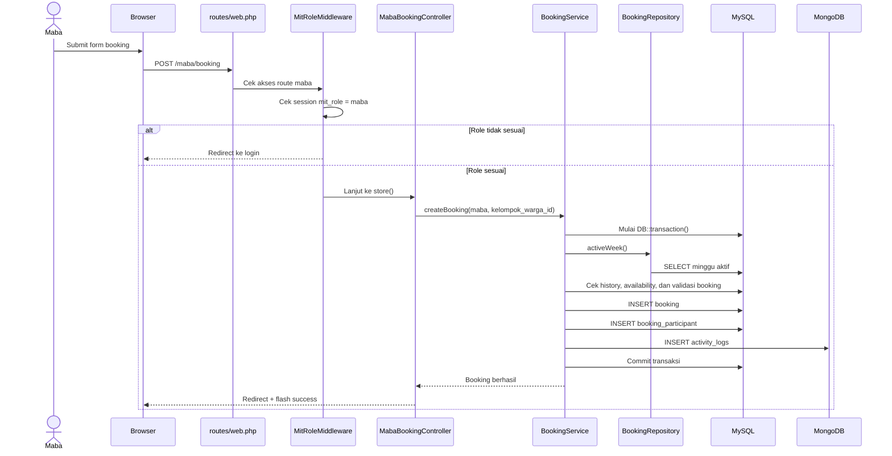

# 📊 Laporan Lengkap Sistem Backend & Database — MIT System

> Dokumen ini menjelaskan **keseluruhan sistem backend** MIT System, termasuk arsitektur, flow data, SEMUA query Eloquent beserta **SQL equivalent** (MySQL) dan **MongoDB query equivalent** (NoSQL), untuk setiap fitur, CRUD, dan operasi.

---

## Daftar Isi

1. [Arsitektur Backend](#1-arsitektur-backend)
2. [Struktur Database — DDL Lengkap](#2-struktur-database--ddl-lengkap)
3. [CRUD & SQL Equivalent — Maba](#3-crud--sql-equivalent--maba)
4. [CRUD & SQL Equivalent — Warga](#4-crud--sql-equivalent--warga)
5. [CRUD & SQL Equivalent — Kelompok Warga](#5-crud--sql-equivalent--kelompok-warga)
6. [CRUD & SQL Equivalent — MIT Week](#6-crud--sql-equivalent--mit-week)
7. [CRUD & SQL Equivalent — Weekly Availability](#7-crud--sql-equivalent--weekly-availability)
8. [Fitur Booking — Semua Operasi](#8-fitur-booking--semua-operasi)
9. [Fitur Realisasi — Semua Operasi](#9-fitur-realisasi--semua-operasi)
10. [Fitur Verifikasi TTD — Semua Operasi](#10-fitur-verifikasi-ttd--semua-operasi)
11. [Fitur Rekomendasi — Semua Operasi](#11-fitur-rekomendasi--semua-operasi)
12. [Fitur Progress TTD — Semua Operasi](#12-fitur-progress-ttd--semua-operasi)
13. [Fitur Autentikasi — Semua Operasi](#13-fitur-autentikasi--semua-operasi)
14. [Fitur Dashboard — Semua Query](#14-fitur-dashboard--semua-query)
15. [Fitur Monitoring — Semua Query](#15-fitur-monitoring--semua-query)
16. [Semua Operasi MongoDB + Native Query](#16-semua-operasi-mongodb--native-query)
17. [Transaction & Locking — Semua Method](#17-transaction--locking--semua-method)
18. [Ringkasan Total](#18-ringkasan-total)
19. [Struktur Direktori & Alur Interaksi (System Flow)](#19-struktur-direktori--alur-interaksi-system-flow)

---

## 1. Arsitektur Backend

### 1.1 Overview Stack

| Komponen | Teknologi | Peran |
|----------|-----------|-------|
| Framework | Laravel 13.8 | HTTP routing, middleware, session, service container |
| Bahasa | PHP 8.3 | Backend logic |
| Template | Blade | Server-side rendering (SSR) |
| Styling | Bootstrap + custom CSS | UI sederhana |
| DB Relasional | MySQL 8 (InnoDB) | Data transaksional (ACID) |
| DB NoSQL | MongoDB 5 | Log & audit trail |
| ORM | Eloquent (Laravel) | Query builder untuk MySQL |
| MongoDB Driver | mongodb/laravel-mongodb | Eloquent extension untuk MongoDB |
| Auth | Session-based | Tanpa JWT/OAuth |
| Environment | Laragon (Windows) | Local development |

### 1.2 Arsitektur 4-Layer

```
┌─────────────────────────────────────────────────────┐
│                   HTTP REQUEST                       │
└──────────────────────┬──────────────────────────────┘
                       ▼
┌─────────────────────────────────────────────────────┐
│              LAYER 1: CONTROLLER (23 files)          │
│                                                     │
│  • Menerima request, validasi input form             │
│  • Memanggil service untuk business logic            │
│  • Boleh query READ ringan untuk view                │
│  • Return Blade view + data                          │
│                                                     │
│  Admin/ (10)  │  Maba/ (7)  │  Warga/ (5)  │ Auth (1) │
└──────────────────────┬──────────────────────────────┘
                       ▼
┌─────────────────────────────────────────────────────┐
│              LAYER 2: SERVICE (14 files)              │
│                                                     │
│  • Business logic utama                              │
│  • Validasi aturan bisnis                            │
│  • DB::transaction() untuk atomicity                 │
│  • lockForUpdate() untuk concurrency                 │
│  • Semua operasi WRITE (create/update/delete)        │
│                                                     │
│  BookingService  │  RealisasiService  │  dll.        │
└──────────────────────┬──────────────────────────────┘
                       ▼
┌─────────────────────────────────────────────────────┐
│           LAYER 3: REPOSITORY (1 file)               │
│                                                     │
│  • Query kecil yang reusable                         │
│  • Dipanggil oleh banyak service                     │
│  • BookingRepository: 4 method                       │
└──────────────────────┬──────────────────────────────┘
                       ▼
┌─────────────────────────────────────────────────────┐
│         LAYER 4: MODEL + DATABASE (15 models)        │
│                                                     │
│  • Eloquent ORM → MySQL (11 model)                   │
│  • MongoDB\Eloquent → MongoDB (4 model)              │
│  • Relationship definitions (hasMany, belongsTo)     │
│  • Casts (boolean, date)                             │
│                                                     │
│  ┌──────────┐    ┌──────────┐                        │
│  │ MySQL 8  │    │ MongoDB 5│                        │
│  │ 11 tabel │    │ 4 koleksi│                        │
│  └──────────┘    └──────────┘                        │
└─────────────────────────────────────────────────────┘
```

### 1.3 Prinsip Desain Backend

| Prinsip | Implementasi |
|---------|-------------|
| **Separation of Concerns** | Controller tidak boleh punya logika bisnis. Semua ada di Service. |
| **ACID Transactions** | Semua operasi multi-tabel dibungkus `DB::transaction()` |
| **Pessimistic Locking** | `lockForUpdate()` pada row kritis sebelum update |
| **Soft-State Participant** | Data `booking_participant` tidak pernah dihapus, hanya update status |
| **Polyglot Persistence** | MySQL untuk data utama, MongoDB untuk log |
| **Fail-Fast Validation** | Validasi bisnis di-throw sebagai `RuntimeException` sebelum query utama |
| **Eager Loading** | `with()` digunakan hingga 5 level untuk mencegah N+1 problem |
| **Constraint-First** | Integritas dijaga di level database (UNIQUE), bukan hanya kode |

---

## 2. Struktur Database — DDL Lengkap

### 2.1 MySQL — 11 Tabel (SQL CREATE TABLE)

```sql
-- ============================================================
-- TABEL 1: maba
-- ============================================================
CREATE TABLE maba (
    maba_id     BIGINT UNSIGNED AUTO_INCREMENT PRIMARY KEY,
    nama        VARCHAR(255) NOT NULL,
    nrp         VARCHAR(255) NOT NULL UNIQUE,
    password    VARCHAR(255) NOT NULL,
    status      ENUM('active', 'inactive') DEFAULT 'active',
    created_at  TIMESTAMP NULL,
    updated_at  TIMESTAMP NULL
);

-- ============================================================
-- TABEL 2: warga
-- ============================================================
CREATE TABLE warga (
    warga_id    BIGINT UNSIGNED AUTO_INCREMENT PRIMARY KEY,
    nama        VARCHAR(255) NOT NULL,
    nrp         VARCHAR(255) NOT NULL UNIQUE,
    angkatan    YEAR NOT NULL,
    password    VARCHAR(255) NOT NULL,
    status      ENUM('active', 'inactive') DEFAULT 'active',
    created_at  TIMESTAMP NULL,
    updated_at  TIMESTAMP NULL
);

-- ============================================================
-- TABEL 3: mit_week
-- ============================================================
CREATE TABLE mit_week (
    week_id                   BIGINT UNSIGNED AUTO_INCREMENT PRIMARY KEY,
    week_number               INT UNSIGNED NOT NULL UNIQUE,
    start_date                DATE NOT NULL,
    end_date                  DATE NOT NULL,
    status                    ENUM('upcoming', 'active', 'completed') DEFAULT 'upcoming',
    availability_input_status ENUM('open', 'closed') DEFAULT 'closed',
    created_at                TIMESTAMP NULL,
    updated_at                TIMESTAMP NULL
);

-- ============================================================
-- TABEL 4: kelompok_warga
-- ============================================================
CREATE TABLE kelompok_warga (
    kelompok_warga_id BIGINT UNSIGNED AUTO_INCREMENT PRIMARY KEY,
    kode_kelompok     INT UNSIGNED NOT NULL UNIQUE,
    rules             TEXT NULL,
    status            ENUM('draft', 'final') DEFAULT 'draft',
    created_at        TIMESTAMP NULL,
    updated_at        TIMESTAMP NULL
);

-- ============================================================
-- TABEL 5: kelompok_warga_member
-- ============================================================
CREATE TABLE kelompok_warga_member (
    member_id          BIGINT UNSIGNED AUTO_INCREMENT PRIMARY KEY,
    kelompok_warga_id  BIGINT UNSIGNED NOT NULL,
    warga_id           BIGINT UNSIGNED NOT NULL,
    is_perwakilan      BOOLEAN DEFAULT FALSE,
    nomor_wa           VARCHAR(255) NULL,
    created_at         TIMESTAMP NULL,
    updated_at         TIMESTAMP NULL,

    FOREIGN KEY (kelompok_warga_id) REFERENCES kelompok_warga(kelompok_warga_id) ON DELETE CASCADE,
    FOREIGN KEY (warga_id) REFERENCES warga(warga_id) ON DELETE CASCADE,
    UNIQUE KEY (kelompok_warga_id, warga_id),
    UNIQUE KEY (warga_id),
    INDEX (kelompok_warga_id, is_perwakilan)
);

-- ============================================================
-- TABEL 6: weekly_availability
-- ============================================================
CREATE TABLE weekly_availability (
    availability_id    BIGINT UNSIGNED AUTO_INCREMENT PRIMARY KEY,
    week_id            BIGINT UNSIGNED NOT NULL,
    kelompok_warga_id  BIGINT UNSIGNED NOT NULL,
    is_available       BOOLEAN DEFAULT TRUE,
    session_mode       TINYINT UNSIGNED DEFAULT 4,
    session_count      TINYINT UNSIGNED DEFAULT 3,
    notes              TEXT NULL,
    created_at         TIMESTAMP NULL,
    updated_at         TIMESTAMP NULL,

    FOREIGN KEY (week_id) REFERENCES mit_week(week_id) ON DELETE CASCADE,
    FOREIGN KEY (kelompok_warga_id) REFERENCES kelompok_warga(kelompok_warga_id) ON DELETE CASCADE,
    UNIQUE KEY (week_id, kelompok_warga_id)
);

-- ============================================================
-- TABEL 7: booking
-- ============================================================
CREATE TABLE booking (
    booking_id          BIGINT UNSIGNED AUTO_INCREMENT PRIMARY KEY,
    week_id             BIGINT UNSIGNED NOT NULL,
    kelompok_warga_id   BIGINT UNSIGNED NOT NULL,
    created_by_maba_id  BIGINT UNSIGNED NOT NULL,
    status              ENUM('pending', 'accepted', 'cancelled', 'completed') DEFAULT 'pending',
    final_schedule      DATETIME NULL,
    final_location      VARCHAR(255) NULL,
    cancelled_reason    TEXT NULL,
    warga_notes         TEXT NULL,
    decided_by_warga_id BIGINT UNSIGNED NULL,
    decided_at          TIMESTAMP NULL,
    created_at          TIMESTAMP NULL,
    updated_at          TIMESTAMP NULL,

    FOREIGN KEY (week_id) REFERENCES mit_week(week_id) ON DELETE CASCADE,
    FOREIGN KEY (kelompok_warga_id) REFERENCES kelompok_warga(kelompok_warga_id) ON DELETE CASCADE,
    FOREIGN KEY (created_by_maba_id) REFERENCES maba(maba_id) ON DELETE CASCADE,
    FOREIGN KEY (decided_by_warga_id) REFERENCES warga(warga_id) ON DELETE SET NULL,
    INDEX (week_id, kelompok_warga_id, status)
);

-- ============================================================
-- TABEL 8: booking_participant
-- ============================================================
CREATE TABLE booking_participant (
    booking_participant_id BIGINT UNSIGNED AUTO_INCREMENT PRIMARY KEY,
    booking_id             BIGINT UNSIGNED NOT NULL,
    maba_id                BIGINT UNSIGNED NOT NULL,
    status                 ENUM('joined', 'left', 'present', 'absent', 'replaced') DEFAULT 'joined',
    replaced_by_maba_id    BIGINT UNSIGNED NULL,
    joined_at              TIMESTAMP NULL,
    left_at                TIMESTAMP NULL,
    created_at             TIMESTAMP NULL,
    updated_at             TIMESTAMP NULL,

    FOREIGN KEY (booking_id) REFERENCES booking(booking_id) ON DELETE CASCADE,
    FOREIGN KEY (maba_id) REFERENCES maba(maba_id) ON DELETE CASCADE,
    FOREIGN KEY (replaced_by_maba_id) REFERENCES maba(maba_id) ON DELETE SET NULL,
    UNIQUE KEY (booking_id, maba_id)
);

-- ============================================================
-- TABEL 9: realisasi
-- ============================================================
CREATE TABLE realisasi (
    realisasi_id                BIGINT UNSIGNED AUTO_INCREMENT PRIMARY KEY,
    booking_id                  BIGINT UNSIGNED NOT NULL UNIQUE,
    week_id                     BIGINT UNSIGNED NOT NULL,
    submitted_by_maba_id        BIGINT UNSIGNED NOT NULL,
    realisasi_is_meeting_held   BOOLEAN DEFAULT TRUE,
    is_warga_as_planned         BOOLEAN DEFAULT TRUE,
    absent_warga_notes          TEXT NULL,
    additional_warga_notes      TEXT NULL,
    general_notes               TEXT NULL,
    status                      ENUM('pending', 'verified', 'revision', 'rejected') DEFAULT 'pending',
    submitted_at                TIMESTAMP NULL,
    verified_at                 TIMESTAMP NULL,
    verified_by_admin_identifier VARCHAR(255) NULL,
    created_at                  TIMESTAMP NULL,
    updated_at                  TIMESTAMP NULL,

    FOREIGN KEY (booking_id) REFERENCES booking(booking_id) ON DELETE CASCADE,
    FOREIGN KEY (week_id) REFERENCES mit_week(week_id) ON DELETE CASCADE,
    FOREIGN KEY (submitted_by_maba_id) REFERENCES maba(maba_id) ON DELETE CASCADE
);

-- ============================================================
-- TABEL 10: verification_result
-- ============================================================
CREATE TABLE verification_result (
    verification_id              BIGINT UNSIGNED AUTO_INCREMENT PRIMARY KEY,
    realisasi_id                 BIGINT UNSIGNED NOT NULL,
    maba_id                      BIGINT UNSIGNED NOT NULL,
    week_id                      BIGINT UNSIGNED NOT NULL,
    claimed_ttd_2022             INT UNSIGNED DEFAULT 0,
    claimed_ttd_2023             INT UNSIGNED DEFAULT 0,
    claimed_ttd_2024             INT UNSIGNED DEFAULT 0,
    verified_ttd_2022            INT UNSIGNED DEFAULT 0,
    verified_ttd_2023            INT UNSIGNED DEFAULT 0,
    verified_ttd_2024            INT UNSIGNED DEFAULT 0,
    status                       ENUM('pending', 'verified', 'revision', 'rejected') DEFAULT 'pending',
    admin_comment                TEXT NULL,
    verified_by_admin_identifier VARCHAR(255) NULL,
    verified_at                  TIMESTAMP NULL,
    created_at                   TIMESTAMP NULL,
    updated_at                   TIMESTAMP NULL,

    FOREIGN KEY (realisasi_id) REFERENCES realisasi(realisasi_id) ON DELETE CASCADE,
    FOREIGN KEY (maba_id) REFERENCES maba(maba_id) ON DELETE CASCADE,
    FOREIGN KEY (week_id) REFERENCES mit_week(week_id) ON DELETE CASCADE,
    UNIQUE KEY (realisasi_id, maba_id)
);

-- ============================================================
-- TABEL 11: maba_kelompok_history
-- ============================================================
CREATE TABLE maba_kelompok_history (
    history_id         BIGINT UNSIGNED AUTO_INCREMENT PRIMARY KEY,
    maba_id            BIGINT UNSIGNED NOT NULL,
    kelompok_warga_id  BIGINT UNSIGNED NOT NULL,
    week_id            BIGINT UNSIGNED NOT NULL,
    booking_id         BIGINT UNSIGNED NOT NULL,
    created_at         TIMESTAMP NULL,

    FOREIGN KEY (maba_id) REFERENCES maba(maba_id) ON DELETE CASCADE,
    FOREIGN KEY (kelompok_warga_id) REFERENCES kelompok_warga(kelompok_warga_id) ON DELETE CASCADE,
    FOREIGN KEY (week_id) REFERENCES mit_week(week_id) ON DELETE CASCADE,
    FOREIGN KEY (booking_id) REFERENCES booking(booking_id) ON DELETE CASCADE,
    UNIQUE KEY (maba_id, kelompok_warga_id)
);
```

---

## 3. CRUD & SQL Equivalent — Maba

### CREATE
```php
// Eloquent
Maba::create(['nama' => $nama, 'nrp' => $nrp, 'password' => Hash::make($pw), 'status' => 'active']);
```
```sql
-- SQL Equivalent
INSERT INTO maba (nama, nrp, password, status, created_at, updated_at)
VALUES ('Nama Maba', '5025261001', '$2y$10$hashedpassword...', 'active', NOW(), NOW());
```

### READ ALL
```php
Maba::orderBy('nrp')->get();
```
```sql
SELECT * FROM maba ORDER BY nrp ASC;
```

### READ ONE
```php
Maba::findOrFail($id);
```
```sql
SELECT * FROM maba WHERE maba_id = 1 LIMIT 1;
-- Throws 404 if not found
```

### READ BY NRP (Login)
```php
Maba::where('nrp', $nrp)->first();
```
```sql
SELECT * FROM maba WHERE nrp = '5025261001' LIMIT 1;
```

### UPDATE
```php
$maba = Maba::findOrFail($id);
$maba->update(['nama' => $nama, 'nrp' => $nrp, 'status' => $status]);
```
```sql
UPDATE maba SET nama = 'Nama Baru', nrp = '5025261002', status = 'inactive',
       updated_at = NOW()
WHERE maba_id = 1;
```

### UPDATE PASSWORD
```php
$maba->update(['password' => Hash::make($newPassword)]);
```
```sql
UPDATE maba SET password = '$2y$10$newhash...', updated_at = NOW()
WHERE maba_id = 1;
```

### DELETE (Safe)
```php
// Cek 5 FK dependencies dulu
DB::table('booking')->where('created_by_maba_id', $id)->exists();
DB::table('booking_participant')->where('maba_id', $id)->exists();
DB::table('realisasi')->where('submitted_by_maba_id', $id)->exists();
DB::table('verification_result')->where('maba_id', $id)->exists();
DB::table('maba_kelompok_history')->where('maba_id', $id)->exists();
// Jika semua false:
$maba->delete();
```
```sql
-- Safe delete check
SELECT EXISTS(SELECT 1 FROM booking WHERE created_by_maba_id = 1);
SELECT EXISTS(SELECT 1 FROM booking_participant WHERE maba_id = 1);
SELECT EXISTS(SELECT 1 FROM realisasi WHERE submitted_by_maba_id = 1);
SELECT EXISTS(SELECT 1 FROM verification_result WHERE maba_id = 1);
SELECT EXISTS(SELECT 1 FROM maba_kelompok_history WHERE maba_id = 1);

-- Jika semua FALSE:
DELETE FROM maba WHERE maba_id = 1;
```

### SEARCH (keyword)
```php
Maba::where(function ($q) use ($keyword) {
    $q->where('nama', 'like', "%{$keyword}%")
      ->orWhere('nrp', 'like', "%{$keyword}%");
})->orderBy('nrp')->paginate(10);
```
```sql
SELECT * FROM maba
WHERE (nama LIKE '%keyword%' OR nrp LIKE '%keyword%')
ORDER BY nrp ASC
LIMIT 10 OFFSET 0;
```

---

## 4. CRUD & SQL Equivalent — Warga

### CREATE
```php
Warga::create(['nama'=>$nama, 'nrp'=>$nrp, 'angkatan'=>$angkatan, 'password'=>Hash::make($pw), 'status'=>'active']);
```
```sql
INSERT INTO warga (nama, nrp, angkatan, password, status, created_at, updated_at)
VALUES ('Nama Warga', '5024211001', 2024, '$2y$10$hash...', 'active', NOW(), NOW());
```

### READ ALL (with membership)
```php
Warga::with('membership.group')->orderBy('nrp')->get();
```
```sql
-- Query 1: Ambil semua warga
SELECT * FROM warga ORDER BY nrp ASC;

-- Query 2: Eager load membership (otomatis oleh Eloquent)
SELECT * FROM kelompok_warga_member WHERE warga_id IN (1, 2, 3, ...);

-- Query 3: Eager load group
SELECT * FROM kelompok_warga WHERE kelompok_warga_id IN (10, 20, ...);
```

### READ AVAILABLE (belum di kelompok)
```php
Warga::where('status', 'active')->whereDoesntHave('membership')->orderBy('nama')->get();
```
```sql
SELECT * FROM warga
WHERE status = 'active'
AND NOT EXISTS (
    SELECT 1 FROM kelompok_warga_member WHERE kelompok_warga_member.warga_id = warga.warga_id
)
ORDER BY nama ASC;
```

### DELETE (Safe)
```php
DB::table('kelompok_warga_member')->where('warga_id', $id)->exists();
DB::table('booking')->where('decided_by_warga_id', $id)->exists();
$warga->delete();
```
```sql
SELECT EXISTS(SELECT 1 FROM kelompok_warga_member WHERE warga_id = 1);
SELECT EXISTS(SELECT 1 FROM booking WHERE decided_by_warga_id = 1);
-- Jika semua FALSE:
DELETE FROM warga WHERE warga_id = 1;
```

---

## 5. CRUD & SQL Equivalent — Kelompok Warga

### CREATE
```php
KelompokWarga::create(['kode_kelompok' => 101, 'rules' => 'Aturan...', 'status' => 'draft']);
```
```sql
INSERT INTO kelompok_warga (kode_kelompok, rules, status, created_at, updated_at)
VALUES (101, 'Aturan...', 'draft', NOW(), NOW());
```

### ADD MEMBER
```php
// Validasi: cek warga belum di kelompok lain
KelompokWargaMember::where('warga_id', $wargaId)->exists();
// Validasi: cek batas 4 anggota
KelompokWargaMember::where('kelompok_warga_id', $groupId)->count();
// Reset perwakilan lama (jika member baru jadi perwakilan)
KelompokWargaMember::where('kelompok_warga_id', $groupId)->update(['is_perwakilan' => false, 'nomor_wa' => null]);
// Insert member baru
KelompokWargaMember::create([...]);
```
```sql
-- Validasi
SELECT EXISTS(SELECT 1 FROM kelompok_warga_member WHERE warga_id = 5);
SELECT COUNT(*) FROM kelompok_warga_member WHERE kelompok_warga_id = 1;

-- Reset perwakilan (jika diperlukan)
UPDATE kelompok_warga_member
SET is_perwakilan = FALSE, nomor_wa = NULL, updated_at = NOW()
WHERE kelompok_warga_id = 1;

-- Insert
INSERT INTO kelompok_warga_member
    (kelompok_warga_id, warga_id, is_perwakilan, nomor_wa, created_at, updated_at)
VALUES (1, 5, TRUE, '081234567890', NOW(), NOW());
```

### SET REPRESENTATIVE
```php
// Reset semua anggota
KelompokWargaMember::where('kelompok_warga_id', $groupId)->update(['is_perwakilan' => false, 'nomor_wa' => null]);
// Set perwakilan baru
$member->update(['is_perwakilan' => true, 'nomor_wa' => $nomorWa]);
```
```sql
BEGIN;

UPDATE kelompok_warga_member
SET is_perwakilan = FALSE, nomor_wa = NULL, updated_at = NOW()
WHERE kelompok_warga_id = 1;

UPDATE kelompok_warga_member
SET is_perwakilan = TRUE, nomor_wa = '081234567890', updated_at = NOW()
WHERE member_id = 3;

COMMIT;
```

### FINALIZE
```php
KelompokWargaMember::where('kelompok_warga_id', $groupId)->count();                    // harus 2-4
KelompokWargaMember::where('kelompok_warga_id', $groupId)->where('is_perwakilan', true)->count();  // harus tepat 1
$group->update(['status' => 'final']);
```
```sql
SELECT COUNT(*) FROM kelompok_warga_member WHERE kelompok_warga_id = 1;
SELECT COUNT(*) FROM kelompok_warga_member WHERE kelompok_warga_id = 1 AND is_perwakilan = TRUE;

UPDATE kelompok_warga SET status = 'final', updated_at = NOW() WHERE kelompok_warga_id = 1;
```

### DELETE
```php
$group->delete();  -- CASCADE akan hapus semua member
```
```sql
DELETE FROM kelompok_warga WHERE kelompok_warga_id = 1;
-- FK CASCADE otomatis: DELETE FROM kelompok_warga_member WHERE kelompok_warga_id = 1;
```

---

## 6. CRUD & SQL Equivalent — MIT Week

### CREATE
```php
MitWeek::create(['week_number'=>1, 'start_date'=>'2026-06-10', 'end_date'=>'2026-06-16', 'status'=>'upcoming', 'availability_input_status'=>'closed']);
```
```sql
INSERT INTO mit_week (week_number, start_date, end_date, status, availability_input_status, created_at, updated_at)
VALUES (1, '2026-06-10', '2026-06-16', 'upcoming', 'closed', NOW(), NOW());
```

### ACTIVATE (dengan cek singularity)
```php
MitWeek::where('status', 'active')->where('week_id', '!=', $weekId)->exists(); // harus FALSE
$week->update(['status' => 'active']);
```
```sql
BEGIN;

SELECT EXISTS(SELECT 1 FROM mit_week WHERE status = 'active' AND week_id != 1);
-- Harus FALSE, jika TRUE → throw error

UPDATE mit_week SET status = 'active', updated_at = NOW() WHERE week_id = 1;

COMMIT;
```

### CLOSE
```sql
UPDATE mit_week SET status = 'completed', availability_input_status = 'closed', updated_at = NOW()
WHERE week_id = 1;
```

### TOGGLE AVAILABILITY INPUT
```sql
UPDATE mit_week
SET availability_input_status = CASE WHEN availability_input_status = 'open' THEN 'closed' ELSE 'open' END,
    updated_at = NOW()
WHERE week_id = 1;
```

---

## 7. CRUD & SQL Equivalent — Weekly Availability

### READ CURRENT
```php
MitWeek::where('status', 'active')->where('availability_input_status', 'open')->first();
WeeklyAvailability::where('week_id', $weekId)->where('kelompok_warga_id', $kelompokId)->first();
```
```sql
SELECT * FROM mit_week WHERE status = 'active' AND availability_input_status = 'open' LIMIT 1;
SELECT * FROM weekly_availability WHERE week_id = 1 AND kelompok_warga_id = 5 LIMIT 1;
```

### CREATE/UPDATE (Upsert)
```php
WeeklyAvailability::updateOrCreate(
    ['week_id' => $weekId, 'kelompok_warga_id' => $groupId],
    ['is_available' => true, 'session_mode' => 4, 'session_count' => 3, 'notes' => 'catatan']
);
```
```sql
INSERT INTO weekly_availability (week_id, kelompok_warga_id, is_available, session_mode, session_count, notes, created_at, updated_at)
VALUES (1, 5, TRUE, 4, 3, 'catatan', NOW(), NOW())
ON DUPLICATE KEY UPDATE
    is_available = TRUE,
    session_mode = 4,
    session_count = 3,
    notes = 'catatan',
    updated_at = NOW();
```

---

## 8. Fitur Booking — Semua Operasi

### 8.1 CREATE BOOKING

**Alur lengkap dalam DB::transaction:**

```sql
BEGIN;

-- Q1: Ambil minggu aktif
SELECT * FROM mit_week WHERE status = 'active' LIMIT 1;

-- Q2: Cek maba sudah pernah bertemu kelompok ini
SELECT EXISTS(
    SELECT 1 FROM maba_kelompok_history
    WHERE maba_id = 1 AND kelompok_warga_id = 5
);

-- Q3: Cek maba punya booking aktif di kelompok yang sama
SELECT EXISTS(
    SELECT 1 FROM booking
    WHERE kelompok_warga_id = 5
    AND status IN ('pending', 'accepted')
    AND EXISTS (
        SELECT 1 FROM booking_participant
        WHERE booking_participant.booking_id = booking.booking_id
        AND maba_id = 1
        AND status IN ('joined', 'present')
    )
);

-- Q4: Cek availability
SELECT * FROM weekly_availability
WHERE week_id = 1 AND kelompok_warga_id = 5 AND is_available = TRUE
LIMIT 1;

-- Q5: Hitung queue aktif
SELECT COUNT(*) FROM booking
WHERE week_id = 1 AND kelompok_warga_id = 5
AND status IN ('pending', 'accepted');

-- Q6: INSERT booking
INSERT INTO booking (week_id, kelompok_warga_id, created_by_maba_id, status, created_at, updated_at)
VALUES (1, 5, 1, 'pending', NOW(), NOW());

-- Q7: INSERT participant pertama
INSERT INTO booking_participant (booking_id, maba_id, status, joined_at, created_at, updated_at)
VALUES (LAST_INSERT_ID(), 1, 'joined', NOW(), NOW(), NOW());

COMMIT;
```

```javascript
// MongoDB — Activity Log (bersamaan)
db.activity_logs.insertOne({
    user_id: 1,
    role: "maba",
    action: "create_booking",
    description: "Maba membuat request booking.",
    metadata: { booking_id: 10, kelompok_warga_id: 5 },
    ip_address: "127.0.0.1",
    created_at: ISODate("2026-06-10T10:30:00Z")
});
```

### 8.2 ACCEPT BOOKING (Warga)

```sql
BEGIN;

-- Q1: Lock booking row
SELECT * FROM booking WHERE booking_id = 10 FOR UPDATE;

-- Q2: Cek warga adalah perwakilan
SELECT EXISTS(
    SELECT 1 FROM kelompok_warga_member
    WHERE kelompok_warga_id = 5 AND warga_id = 3 AND is_perwakilan = TRUE
);

-- Q3: UPDATE booking
UPDATE booking SET
    status = 'accepted',
    warga_notes = 'Catatan warga',
    decided_by_warga_id = 3,
    decided_at = NOW(),
    updated_at = NOW()
WHERE booking_id = 10;

COMMIT;
```

```javascript
// MongoDB
db.activity_logs.insertOne({
    user_id: 3, role: "warga", action: "accept_booking",
    description: "Warga accept booking.",
    metadata: { booking_id: 10 },
    ip_address: "127.0.0.1", created_at: new Date()
});
```

### 8.3 CANCEL BOOKING (Warga)

```sql
BEGIN;

SELECT * FROM booking WHERE booking_id = 10 FOR UPDATE;

-- Cek perwakilan (sama seperti accept)
SELECT EXISTS(SELECT 1 FROM kelompok_warga_member WHERE kelompok_warga_id = 5 AND warga_id = 3 AND is_perwakilan = TRUE);

UPDATE booking SET
    status = 'cancelled',
    cancelled_reason = 'Ada jadwal bentrok',
    decided_by_warga_id = 3,
    decided_at = NOW(),
    updated_at = NOW()
WHERE booking_id = 10;

COMMIT;
```

```javascript
db.activity_logs.insertOne({
    user_id: 3, role: "warga", action: "cancel_booking",
    description: "Warga cancel booking.",
    metadata: { booking_id: 10, reason: "Ada jadwal bentrok" },
    ip_address: "127.0.0.1", created_at: new Date()
});
```

### 8.4 JOIN BOOKING (Maba)

```sql
BEGIN;

-- Q1: Lock booking
SELECT * FROM booking WHERE booking_id = 10 FOR UPDATE;

-- Q2: Cek riwayat bertemu
SELECT EXISTS(SELECT 1 FROM maba_kelompok_history WHERE maba_id = 2 AND kelompok_warga_id = 5);

-- Q3: Cek & lock existing participant
SELECT * FROM booking_participant
WHERE booking_id = 10 AND maba_id = 2
FOR UPDATE;

-- Q4: Cek booking aktif di kelompok sama
SELECT EXISTS(
    SELECT 1 FROM booking
    WHERE kelompok_warga_id = 5 AND status IN ('pending','accepted')
    AND EXISTS (
        SELECT 1 FROM booking_participant
        WHERE booking_participant.booking_id = booking.booking_id
        AND maba_id = 2 AND status IN ('joined','present')
    )
);

-- Q5: Ambil availability
SELECT * FROM weekly_availability WHERE week_id = 1 AND kelompok_warga_id = 5 LIMIT 1;

-- Q6: Hitung peserta aktif
SELECT COUNT(*) FROM booking_participant WHERE booking_id = 10 AND status IN ('joined','present');

-- Q7a: Jika row lama berstatus 'left' → REJOIN (update, bukan insert)
UPDATE booking_participant SET
    status = 'joined', joined_at = NOW(), left_at = NULL, replaced_by_maba_id = NULL, updated_at = NOW()
WHERE booking_id = 10 AND maba_id = 2 AND status = 'left';

-- Q7b: Jika belum pernah → INSERT baru
INSERT INTO booking_participant (booking_id, maba_id, status, joined_at, created_at, updated_at)
VALUES (10, 2, 'joined', NOW(), NOW(), NOW());

COMMIT;
```

```javascript
db.activity_logs.insertOne({
    user_id: 2, role: "maba", action: "join_booking",
    description: "Maba join booking accepted.",
    metadata: { booking_id: 10 },
    ip_address: "127.0.0.1", created_at: new Date()
});
```

### 8.5 LEAVE BOOKING (Maba)

```sql
BEGIN;

SELECT * FROM booking WHERE booking_id = 10 FOR UPDATE;

-- Cari participant, lock
SELECT * FROM booking_participant
WHERE booking_id = 10 AND maba_id = 2 AND status = 'joined'
FOR UPDATE;

-- Update status (TIDAK DELETE)
UPDATE booking_participant SET
    status = 'left', left_at = NOW(), updated_at = NOW()
WHERE booking_participant_id = 25;

COMMIT;
```

```javascript
db.activity_logs.insertOne({
    user_id: 2, role: "maba", action: "leave_booking",
    description: "Maba keluar dari booking.",
    metadata: { booking_id: 10 },
    ip_address: "127.0.0.1", created_at: new Date()
});
```

### 8.6 UPDATE FINAL SCHEDULE (Maba)

```sql
BEGIN;

SELECT * FROM booking WHERE booking_id = 10 FOR UPDATE;

-- Cek maba adalah peserta aktif
SELECT EXISTS(
    SELECT 1 FROM booking_participant
    WHERE booking_id = 10 AND maba_id = 1 AND status = 'joined'
);

UPDATE booking SET
    final_schedule = '2026-06-15 10:00:00',
    final_location = 'Gedung Teknik Informatika Lt. 2',
    updated_at = NOW()
WHERE booking_id = 10;

COMMIT;
```

```javascript
db.activity_logs.insertOne({
    user_id: 1, role: "maba", action: "update_final_schedule",
    description: "Maba mengisi jadwal dan lokasi final booking.",
    metadata: { booking_id: 10, final_schedule: "2026-06-15 10:00:00", final_location: "Gedung TI Lt. 2" },
    ip_address: "127.0.0.1", created_at: new Date()
});
```

### 8.7 QUERY: Available Groups for Maba

```php
WeeklyAvailability::with(['group.representativeMember.warga'])
    ->where('week_id', $weekId)->where('is_available', true)->get();
```
```sql
-- Query utama
SELECT * FROM weekly_availability WHERE week_id = 1 AND is_available = TRUE;

-- Eager load group
SELECT * FROM kelompok_warga WHERE kelompok_warga_id IN (5, 6, 7, ...);

-- Eager load representativeMember
SELECT * FROM kelompok_warga_member
WHERE kelompok_warga_id IN (5, 6, 7, ...) AND is_perwakilan = TRUE;

-- Eager load warga perwakilan
SELECT * FROM warga WHERE warga_id IN (3, 4, 8, ...);

-- Per kelompok (dalam loop PHP):
SELECT COUNT(*) FROM booking WHERE week_id=1 AND kelompok_warga_id=5 AND status IN ('pending','accepted');
SELECT EXISTS(SELECT 1 FROM maba_kelompok_history WHERE maba_id=1 AND kelompok_warga_id=5);
```

### 8.8 QUERY: Joinable Accepted Bookings

```sql
-- Query utama
SELECT * FROM booking WHERE week_id = 1 AND status = 'accepted';

-- Per booking (dalam loop PHP):
SELECT * FROM weekly_availability WHERE week_id = 1 AND kelompok_warga_id = 5 LIMIT 1;
SELECT COUNT(*) FROM booking_participant WHERE booking_id = 10 AND status IN ('joined','present');
SELECT EXISTS(SELECT 1 FROM maba_kelompok_history WHERE maba_id = 1 AND kelompok_warga_id = 5);
SELECT EXISTS(SELECT 1 FROM booking_participant WHERE booking_id = 10 AND maba_id = 1 AND status IN ('joined','present'));
```

### 8.9 QUERY: My Bookings (Maba)

```php
BookingParticipant::with(['booking.group.representativeMember.warga', 'booking.week'])
    ->where('maba_id', $mabaId)
    ->whereIn('status', ['joined', 'present'])
    ->whereHas('booking', fn($q) => $q->whereIn('status', ['pending', 'accepted', 'completed']))
    ->get();
```
```sql
SELECT bp.* FROM booking_participant bp
WHERE bp.maba_id = 1
AND bp.status IN ('joined', 'present')
AND EXISTS (
    SELECT 1 FROM booking b
    WHERE b.booking_id = bp.booking_id
    AND b.status IN ('pending', 'accepted', 'completed')
);

-- + 3 eager load queries (booking, group, representativeMember, warga, week)
```

### 8.10 QUERY: Booking History

```sql
SELECT bp.* FROM booking_participant bp
WHERE bp.maba_id = 1
AND EXISTS (
    SELECT 1 FROM booking b
    WHERE b.booking_id = bp.booking_id
    AND b.status IN ('cancelled', 'completed')
)
ORDER BY bp.created_at DESC;
```

### 8.11 QUERY: Incoming Bookings (Warga)

```sql
SELECT b.* FROM booking b
WHERE b.kelompok_warga_id = 5 AND b.status = 'pending'
ORDER BY b.created_at DESC;
-- + eager load: creator, participants.maba, week
```

---

## 9. Fitur Realisasi — Semua Operasi

### SUBMIT REALISASI (1 transaksi, 5 tabel MySQL + 2 koleksi MongoDB)

```sql
BEGIN;

-- Q1: Lock booking + load relasi
SELECT * FROM booking WHERE booking_id = 10 FOR UPDATE;

-- Q2: Cek peserta aktif
SELECT EXISTS(
    SELECT 1 FROM booking_participant
    WHERE booking_id = 10 AND maba_id = 1 AND status = 'joined'
);

-- Q3: Cek realisasi belum ada
SELECT EXISTS(SELECT 1 FROM realisasi WHERE booking_id = 10);

-- Q4: Ambil valid participant IDs
SELECT maba_id FROM booking_participant
WHERE booking_id = 10 AND status IN ('joined', 'left');

-- Q5: INSERT realisasi
INSERT INTO realisasi (booking_id, week_id, submitted_by_maba_id, realisasi_is_meeting_held,
    is_warga_as_planned, general_notes, status, submitted_at, created_at, updated_at)
VALUES (10, 1, 1, TRUE, TRUE, 'Pertemuan lancar', 'pending', NOW(), NOW(), NOW());

-- Q6: UPDATE participant status (per maba)
UPDATE booking_participant SET status = 'present', updated_at = NOW()
WHERE booking_id = 10 AND maba_id = 1;

UPDATE booking_participant SET status = 'present', updated_at = NOW()
WHERE booking_id = 10 AND maba_id = 2;

UPDATE booking_participant SET status = 'absent', updated_at = NOW()
WHERE booking_id = 10 AND maba_id = 3;

-- Q7: INSERT verification_result per maba present
INSERT INTO verification_result (realisasi_id, maba_id, week_id, claimed_ttd_2022, claimed_ttd_2023, claimed_ttd_2024, status, created_at, updated_at)
VALUES (LAST_INSERT_ID(), 1, 1, 1, 3, 5, 'pending', NOW(), NOW());

INSERT INTO verification_result (realisasi_id, maba_id, week_id, claimed_ttd_2022, claimed_ttd_2023, claimed_ttd_2024, status, created_at, updated_at)
VALUES (LAST_INSERT_ID(), 2, 1, 0, 2, 6, 'pending', NOW(), NOW());

-- Q8: UPDATE booking → completed
UPDATE booking SET status = 'completed', updated_at = NOW() WHERE booking_id = 10;

COMMIT;
```

```javascript
// MongoDB — Upload Bukti Log
db.upload_bukti_logs.insertOne({
    realisasi_id: 5,
    booking_id: 10,
    maba_id: 1,
    file_name: "bukti_pertemuan.jpg",
    file_path: "mit-bukti/abc123.jpg",
    file_url: "http://localhost/storage/mit-bukti/abc123.jpg",
    mime_type: "image/jpeg",
    file_size: 245000,
    notes: "Foto bersama",
    created_at: new Date()
});

// MongoDB — Activity Log
db.activity_logs.insertOne({
    user_id: 1, role: "maba", action: "submit_realisasi",
    description: "Maba mengajukan realisasi pertemuan.",
    metadata: { booking_id: 10, realisasi_id: 5 },
    ip_address: "127.0.0.1", created_at: new Date()
});
```

---

## 10. Fitur Verifikasi TTD — Semua Operasi

### READ PENDING REQUESTS

```sql
SELECT vr.*, m.nama, m.nrp
FROM verification_result vr
JOIN maba m ON m.maba_id = vr.maba_id
WHERE vr.week_id = 1 AND vr.status = 'pending'
ORDER BY vr.created_at ASC;

-- + eager load: realisasi.booking.group.representativeMember.warga (4 JOIN tambahan)
```

```javascript
// MongoDB — Ambil latest upload bukti per verifikasi
db.upload_bukti_logs.find({
    realisasi_id: 5,
    maba_id: 1
}).sort({ created_at: -1 }).limit(1);
```

### VERIFY REQUEST (Admin)

```sql
BEGIN;

-- Q1: Lock verification result
SELECT * FROM verification_result WHERE verification_id = 15 FOR UPDATE;

-- Q2: UPDATE verified values
UPDATE verification_result SET
    verified_ttd_2022 = 1,
    verified_ttd_2023 = 3,
    verified_ttd_2024 = 4,
    status = 'verified',
    admin_comment = 'Sesuai bukti',
    verified_by_admin_identifier = 'admin_mit',
    verified_at = NOW(),
    updated_at = NOW()
WHERE verification_id = 15;

-- Q3: INSERT history (jika verified) — firstOrCreate
INSERT INTO maba_kelompok_history (maba_id, kelompok_warga_id, week_id, booking_id, created_at)
SELECT 1, 5, 1, 10, NOW()
WHERE NOT EXISTS (
    SELECT 1 FROM maba_kelompok_history WHERE maba_id = 1 AND kelompok_warga_id = 5
);

-- Q4: SYNC realisasi status
SELECT * FROM verification_result WHERE realisasi_id = 5;

-- Logika sync (dijalankan di PHP):
-- Jika ada status = 'pending'    → UPDATE realisasi SET status = 'pending'
-- Jika ada status = 'revision'   → UPDATE realisasi SET status = 'revision'
-- Jika SEMUA = 'verified'        → UPDATE realisasi SET status = 'verified', verified_at = NOW()
-- Jika SEMUA = 'rejected'        → UPDATE realisasi SET status = 'rejected', verified_at = NOW()
-- Else                           → UPDATE realisasi SET status = 'revision'

UPDATE realisasi SET status = 'verified', verified_at = NOW(), updated_at = NOW()
WHERE realisasi_id = 5;

COMMIT;
```

```javascript
// MongoDB — Revision History
db.revision_histories.insertOne({
    realisasi_id: 5,
    admin_identifier: "admin_mit",
    old_status: "pending",
    new_status: "verified",
    notes: "Sesuai bukti",
    changed_fields: {
        verification_id: 15,
        maba_id: 1,
        verified_ttd_2022: 1,
        verified_ttd_2023: 3,
        verified_ttd_2024: 4
    },
    created_at: new Date()
});
```

---

## 11. Fitur Rekomendasi — Semua Operasi

### RECOMMEND

```sql
-- Q1: Ambil maba berdasarkan NRP list
SELECT * FROM maba WHERE nrp IN ('5025261001', '5025261002') AND status = 'active';

-- Q2: Ambil minggu aktif
SELECT * FROM mit_week WHERE status = 'active' LIMIT 1;

-- Q3: Ambil availability
SELECT wa.*, kw.kode_kelompok
FROM weekly_availability wa
JOIN kelompok_warga kw ON kw.kelompok_warga_id = wa.kelompok_warga_id
WHERE wa.week_id = 1 AND wa.is_available = TRUE;

-- Per kelompok (loop):
-- Q4: Queue count
SELECT COUNT(*) FROM booking WHERE week_id=1 AND kelompok_warga_id=5 AND status IN ('pending','accepted');

-- Q5: Cek riwayat bertemu (ANY maba in list)
SELECT EXISTS(SELECT 1 FROM maba_kelompok_history WHERE maba_id IN (1,2) AND kelompok_warga_id = 5);

-- Q6: Cek booking aktif (per maba)
SELECT EXISTS(
    SELECT 1 FROM booking WHERE kelompok_warga_id = 5 AND status IN ('pending','accepted')
    AND EXISTS (SELECT 1 FROM booking_participant WHERE booking_participant.booking_id = booking.booking_id AND maba_id = 1 AND status IN ('joined','present'))
);

-- Q7: Hitung completed bookings
SELECT COUNT(*) FROM booking WHERE kelompok_warga_id = 5 AND status = 'completed';
```

**Scoring algorithm (PHP):**
```
Base score: +40 (tersedia)
+30 jika semua maba belum pernah bertemu
-100 jika ada yang sudah bertemu (diskualifikasi)
-100 jika ada booking aktif (diskualifikasi)
+20 jika queue tersedia
-100 jika queue penuh (diskualifikasi)
+10 jika kelompok jarang dipilih (completed ≤ 1)
```

```javascript
// MongoDB — Recommendation Log
db.recommendation_logs.insertOne({
    requested_by_maba_id: 1,
    input_nrp_list: ["5025261001", "5025261002"],
    recommended_groups: [
        { kelompok_warga_id: 5, score: 100, reasons: ["..."] },
        { kelompok_warga_id: 8, score: 80, reasons: ["..."] }
    ],
    scoring_detail: [ /* ... */ ],
    created_at: new Date()
});
```

---

## 12. Fitur Progress TTD — Semua Operasi

### AGGREGATE PROGRESS

```php
VerificationResult::where('maba_id', $mabaId)->where('status', 'verified')
    ->selectRaw('COALESCE(SUM(verified_ttd_2022),0) as total_2022')
    ->selectRaw('COALESCE(SUM(verified_ttd_2023),0) as total_2023')
    ->selectRaw('COALESCE(SUM(verified_ttd_2024),0) as total_2024')
    ->first();
```
```sql
SELECT
    COALESCE(SUM(verified_ttd_2022), 0) AS total_2022,
    COALESCE(SUM(verified_ttd_2023), 0) AS total_2023,
    COALESCE(SUM(verified_ttd_2024), 0) AS total_2024
FROM verification_result
WHERE maba_id = 1 AND status = 'verified';
```

Target: `2022:4 + 2023:24 + 2024:72 = 100 TTD total`

### WEEKLY RECAP

```sql
SELECT vr.*, mw.week_number, kw.kode_kelompok
FROM verification_result vr
LEFT JOIN mit_week mw ON mw.week_id = vr.week_id
LEFT JOIN realisasi r ON r.realisasi_id = vr.realisasi_id
LEFT JOIN booking b ON b.booking_id = r.booking_id
LEFT JOIN kelompok_warga kw ON kw.kelompok_warga_id = b.kelompok_warga_id
WHERE vr.maba_id = 1
ORDER BY vr.week_id ASC;
```

### HISTORY GROUPS

```sql
SELECT mkh.*, kw.kode_kelompok, mw.week_number
FROM maba_kelompok_history mkh
JOIN kelompok_warga kw ON kw.kelompok_warga_id = mkh.kelompok_warga_id
JOIN mit_week mw ON mw.week_id = mkh.week_id
WHERE mkh.maba_id = 1
ORDER BY mkh.created_at DESC;
```

---

## 13. Fitur Autentikasi — Semua Operasi

### LOGIN ADMIN
```php
// Tidak ada query database — login via config('mit.admin.username')/(password)
hash_equals($adminUsername, $username);
hash_equals($adminPassword, $password);
```
```sql
-- TIDAK ADA QUERY SQL — admin di-hardcode di .env
```

### LOGIN WARGA
```php
Warga::where('nrp', $nrp)->first();
```
```sql
SELECT * FROM warga WHERE nrp = '5024211001' LIMIT 1;
-- Lalu PHP: Hash::check($password, $warga->password)
```

### LOGIN MABA
```php
Maba::where('nrp', $nrp)->first();
```
```sql
SELECT * FROM maba WHERE nrp = '5025261001' LIMIT 1;
-- Lalu PHP: Hash::check($password, $maba->password)
```

### SESSION (bukan database)
```
Session keys: mit_role, mit_user_id, mit_user_name, mit_admin_identifier
Disimpan di server-side session (file/cookie), bukan database.
```

### MIDDLEWARE (bukan database)
```php
// MitRoleMiddleware — hanya cek session, tidak ada query database
$currentRole = session('mit_role');
if (!in_array($currentRole, $roles)) → redirect ke login
```

---

## 14. Fitur Dashboard — Semua Query

### ADMIN DASHBOARD

```sql
SELECT COUNT(*) FROM maba;
SELECT COUNT(*) FROM warga;
SELECT COUNT(*) FROM kelompok_warga;
SELECT * FROM mit_week WHERE status = 'active' LIMIT 1;
SELECT COUNT(*) FROM booking WHERE status IN ('pending', 'accepted');
SELECT COUNT(*) FROM realisasi WHERE status = 'pending';
SELECT COUNT(*) FROM verification_result WHERE status = 'pending';
SELECT * FROM mit_week ORDER BY week_number DESC;
```

### MABA DASHBOARD

```sql
SELECT * FROM maba WHERE maba_id = 1 LIMIT 1;
SELECT * FROM mit_week WHERE status = 'active' LIMIT 1;

-- Active bookings count
SELECT COUNT(*) FROM booking_participant
WHERE maba_id = 1 AND status IN ('joined', 'present')
AND EXISTS (
    SELECT 1 FROM booking
    WHERE booking.booking_id = booking_participant.booking_id
    AND booking.status IN ('pending', 'accepted')
);

-- History count
SELECT COUNT(*) FROM maba_kelompok_history WHERE maba_id = 1;
```

### WARGA DASHBOARD

```sql
SELECT * FROM warga WHERE warga_id = 3 LIMIT 1;

SELECT kwm.*, kw.* FROM kelompok_warga_member kwm
JOIN kelompok_warga kw ON kw.kelompok_warga_id = kwm.kelompok_warga_id
WHERE kwm.warga_id = 3 LIMIT 1;

SELECT * FROM mit_week WHERE status = 'active' LIMIT 1;

SELECT COUNT(*) FROM booking WHERE kelompok_warga_id = 5 AND status = 'pending';
SELECT COUNT(*) FROM booking WHERE kelompok_warga_id = 5 AND status = 'accepted';
```

---

## 15. Fitur Monitoring — Semua Query

### BOOKING MONITORING (Admin)

```sql
-- List bookings per minggu
SELECT b.* FROM booking b
WHERE b.week_id = 1
AND (b.status = 'pending' OR TRUE)  -- optional filter
ORDER BY b.created_at DESC
LIMIT 10 OFFSET 0;

-- + eager load: group.representativeMember.warga, creator, participants.maba, week

-- Detail booking
SELECT b.* FROM booking b WHERE b.booking_id = 10;
-- + eager load: group.representativeMember.warga, group.members.warga, creator, participants.maba, week, realisasi.verificationResults.maba, decider
```

### QUEUE MONITORING (Admin)

```sql
SELECT * FROM mit_week WHERE status = 'active' LIMIT 1;

SELECT wa.* FROM weekly_availability wa
WHERE wa.week_id = 1 AND wa.is_available = TRUE
ORDER BY wa.kelompok_warga_id;
-- + eager load: group.representativeMember.warga, group.members.warga

-- Per kelompok:
SELECT COUNT(*) FROM booking WHERE week_id = 1 AND kelompok_warga_id = 5 AND status = 'pending';
SELECT COUNT(*) FROM booking WHERE week_id = 1 AND kelompok_warga_id = 5 AND status = 'accepted';
SELECT COUNT(*) FROM booking WHERE week_id = 1 AND kelompok_warga_id = 5 AND status IN ('pending', 'accepted');
```

### REALISASI MONITORING (Admin)

```sql
SELECT r.* FROM realisasi r
WHERE r.week_id = 1
AND (r.status = 'pending' OR TRUE)  -- optional filter
ORDER BY r.submitted_at DESC
LIMIT 10 OFFSET 0;
-- + eager load: booking.group.representativeMember.warga, submitter, week, verificationResults.maba

-- Detail realisasi
SELECT r.* FROM realisasi r WHERE r.realisasi_id = 5;
-- + eager load: booking.group.members.warga, booking.participants.maba, submitter, week, verificationResults.maba
```

---

## 16. Semua Operasi MongoDB + Native Query

### 16.1 INSERT Operations (4 jenis)

#### Activity Log
```php
ActivityLog::create([...]);
```
```javascript
db.activity_logs.insertOne({
    user_id: NumberInt(1),
    role: "maba",                     // "admin" | "warga" | "maba"
    action: "create_booking",          // nama aksi
    description: "Maba membuat request booking.",
    metadata: {                        // field dinamis, bervariasi per aksi
        booking_id: NumberInt(10),
        kelompok_warga_id: NumberInt(5)
    },
    ip_address: "127.0.0.1",
    created_at: ISODate("2026-06-10T10:30:00Z"),
    updated_at: ISODate("2026-06-10T10:30:00Z")
});
```

**Semua action yang dicatat:**

| Role | Actions |
|------|---------|
| maba | `create_booking`, `join_booking`, `rejoin_booking`, `leave_booking`, `update_final_schedule`, `submit_realisasi` |
| warga | `accept_booking`, `cancel_booking` |

#### Recommendation Log
```php
RecommendationLog::create([...]);
```
```javascript
db.recommendation_logs.insertOne({
    requested_by_maba_id: NumberInt(1),
    input_nrp_list: ["5025261001", "5025261002"],
    recommended_groups: [
        {
            kelompok_warga_id: 5,
            kode_kelompok: 101,
            perwakilan: "Nama Warga",
            wa: "081234567890",
            score: 100,
            queue_count: 1,
            max_queue: 3,
            sisa_queue: 2,
            session_mode: 4,
            reasons: [
                "Kelompok tersedia pada minggu aktif.",
                "Semua maba belum pernah bertemu kelompok ini.",
                "Queue masih tersedia: 1/3."
            ]
        }
    ],
    scoring_detail: [ /* sama dengan recommended_groups */ ],
    created_at: ISODate("2026-06-10T11:00:00Z"),
    updated_at: ISODate("2026-06-10T11:00:00Z")
});
```

#### Revision History
```php
RevisionHistory::create([...]);
```
```javascript
db.revision_histories.insertOne({
    realisasi_id: NumberInt(5),
    admin_identifier: "admin_mit",
    old_status: "pending",
    new_status: "verified",
    notes: "Sesuai bukti foto",
    changed_fields: {
        verification_id: NumberInt(15),
        maba_id: NumberInt(1),
        verified_ttd_2022: NumberInt(1),
        verified_ttd_2023: NumberInt(3),
        verified_ttd_2024: NumberInt(4)
    },
    created_at: ISODate("2026-06-12T14:00:00Z"),
    updated_at: ISODate("2026-06-12T14:00:00Z")
});
```

#### Upload Bukti Log
```php
UploadBuktiLog::create([...]);
```
```javascript
db.upload_bukti_logs.insertOne({
    realisasi_id: NumberInt(5),
    booking_id: NumberInt(10),
    maba_id: NumberInt(1),
    file_name: "bukti_pertemuan.jpg",
    file_path: "mit-bukti/randomhash.jpg",
    file_url: "http://localhost:8000/storage/mit-bukti/randomhash.jpg",
    mime_type: "image/jpeg",
    file_size: NumberInt(245000),
    notes: "Foto bersama kelompok",
    created_at: ISODate("2026-06-11T15:00:00Z"),
    updated_at: ISODate("2026-06-11T15:00:00Z")
});
```

### 16.2 READ Operations (4 jenis)

#### Admin: View Activity Logs
```php
ActivityLog::orderBy('created_at', 'desc')->paginate(15);
```
```javascript
db.activity_logs.find({})
    .sort({ created_at: -1 })
    .skip(0)    // pagination offset
    .limit(15);
```

#### Admin: View Recommendation Logs
```php
RecommendationLog::orderBy('created_at', 'desc')->paginate(15);
```
```javascript
db.recommendation_logs.find({})
    .sort({ created_at: -1 })
    .skip(0)
    .limit(15);
```

#### Admin: View Revision Histories
```php
RevisionHistory::orderBy('created_at', 'desc')->paginate(15);
```
```javascript
db.revision_histories.find({})
    .sort({ created_at: -1 })
    .skip(0)
    .limit(15);
```

#### Verification: Latest Upload Bukti
```php
UploadBuktiLog::where('realisasi_id', $realisasiId)
    ->where('maba_id', $mabaId)
    ->get()->sortByDesc('created_at')->first();
```
```javascript
db.upload_bukti_logs.find({
    realisasi_id: NumberInt(5),
    maba_id: NumberInt(1)
}).sort({ created_at: -1 }).limit(1);
```

#### Admin: Count per Collection
```php
ActivityLog::count();
RecommendationLog::count();
RevisionHistory::count();
```
```javascript
db.activity_logs.countDocuments({});
db.recommendation_logs.countDocuments({});
db.revision_histories.countDocuments({});
```

---

## 17. Transaction & Locking — Semua Method

### 17.1 Daftar Semua `DB::transaction()`

| No | File | Method | Tabel Terpengaruh | Lock? |
|----|------|--------|-------------------|-------|
| 1 | BookingService | `createBooking()` | booking, booking_participant | Tidak |
| 2 | BookingService | `acceptBooking()` | booking | `lockForUpdate` |
| 3 | BookingService | `acceptBookingWithoutSchedule()` | booking | `lockForUpdate` |
| 4 | BookingService | `cancelBooking()` | booking | `lockForUpdate` |
| 5 | BookingService | `joinBooking()` | booking, booking_participant | **Double lock** |
| 6 | BookingService | `updateFinalScheduleByMaba()` | booking | `lockForUpdate` |
| 7 | BookingService | `leaveBooking()` | booking, booking_participant | **Double lock** |
| 8 | MabaRealisasiWebService | `submit()` | booking, booking_participant, realisasi, verification_result | `lockForUpdate` |
| 9 | VerificationService | `verifyRequestById()` | verification_result, realisasi, maba_kelompok_history | `lockForUpdate` |
| 10 | KelompokWargaAdmin | `addMember()` | kelompok_warga_member | Tidak |
| 11 | KelompokWargaAdmin | `removeMember()` | kelompok_warga_member | Tidak |
| 12 | KelompokWargaAdmin | `setRepresentative()` | kelompok_warga_member | Tidak |
| 13 | MitWeekAdmin | `activate()` | mit_week | Tidak |

### 17.2 Cara Kerja `lockForUpdate`

```sql
-- Eloquent
Booking::lockForUpdate()->findOrFail(10);

-- SQL yang dihasilkan
SELECT * FROM booking WHERE booking_id = 10 FOR UPDATE;

-- Efek:
-- 1. Row booking_id=10 di-LOCK di level InnoDB
-- 2. Thread/request lain yang mau akses row ini harus WAIT
-- 3. Lock dilepas saat COMMIT atau ROLLBACK
-- 4. Mencegah race condition saat 2 request concurrent
```

### 17.3 Double Lock Pattern (joinBooking, leaveBooking)

```sql
BEGIN;

-- Lock 1: Lock booking
SELECT * FROM booking WHERE booking_id = 10 FOR UPDATE;

-- Lock 2: Lock participant
SELECT * FROM booking_participant
WHERE booking_id = 10 AND maba_id = 2
FOR UPDATE;

-- ... operasi ...
COMMIT;
```

Alasan: Mencegah 2 maba join slot terakhir secara bersamaan.

---

## 18. Ringkasan Total

### Statistik Query

| Kategori | Jumlah |
|----------|--------|
| **Total query MySQL unik** | **~130+** |
| **Total operasi MongoDB** | **~14** (8 INSERT jenis, 6 READ jenis) |
| Query di Service layer | ~80 |
| Query di Controller layer | ~45 |
| Query di Repository layer | 4 |
| `DB::transaction()` | 13 method |
| `lockForUpdate()` | 8 method |
| UNIQUE constraints | 10 |
| Foreign keys | 17 |
| Indexes | 2 custom + 10 UNIQUE |

### Tabel yang Paling Sering Di-query

| Tabel | Estimasi Query | Operasi Dominan |
|-------|---------------|----------------|
| `booking` | ~35 | WHERE status, lockForUpdate, count, update |
| `booking_participant` | ~20 | WHERE status, lockForUpdate, create, update |
| `maba` | ~15 | findOrFail (auth + session), create, delete |
| `verification_result` | ~12 | WHERE status, lockForUpdate, selectRaw SUM |
| `kelompok_warga_member` | ~12 | WHERE is_perwakilan, count, create, update |
| `mit_week` | ~10 | WHERE status='active', orderBy |
| `weekly_availability` | ~8 | WHERE is_available, updateOrCreate |
| `maba_kelompok_history` | ~8 | exists, firstOrCreate, count |
| `kelompok_warga` | ~6 | with members, findOrFail, delete |
| `realisasi` | ~6 | create, update status, findOrFail |
| `warga` | ~6 | findOrFail, whereDoesntHave, where nrp |

### Teknik Query yang Digunakan

| Teknik | SQL Equivalent | Jumlah |
|--------|---------------|--------|
| `where()` | `WHERE col = ?` | ~80+ |
| `whereIn()` | `WHERE col IN (?, ?)` | ~15 |
| `whereHas()` | `WHERE EXISTS (SELECT 1 FROM ...)` | ~6 |
| `whereDoesntHave()` | `WHERE NOT EXISTS (SELECT ...)` | 2 |
| `with()` | Separate SELECT (eager load) | ~25 |
| `lockForUpdate()` | `SELECT ... FOR UPDATE` | 8 |
| `findOrFail()` | `SELECT ... WHERE pk = ? LIMIT 1` | ~20 |
| `exists()` | `SELECT EXISTS(SELECT 1 ...)` | ~12 |
| `count()` | `SELECT COUNT(*)` | ~12 |
| `create()` | `INSERT INTO ... VALUES (...)` | ~15 |
| `update()` | `UPDATE ... SET ... WHERE pk = ?` | ~25 |
| `delete()` | `DELETE FROM ... WHERE pk = ?` | 3 |
| `updateOrCreate()` | `INSERT ... ON DUPLICATE KEY UPDATE` | 2 |
| `firstOrCreate()` | `INSERT ... SELECT WHERE NOT EXISTS` | 1 |
| `selectRaw()` | `SELECT COALESCE(SUM(...),0) AS ...` | 2 |
| `orderBy()` | `ORDER BY col ASC/DESC` | ~12 |
| `paginate()` | `LIMIT ? OFFSET ?` | ~8 |
| `when()` | Conditional WHERE | 3 |
| `pluck()` | `SELECT col FROM ...` | 1 |
| `latest()` | `ORDER BY created_at DESC` | ~5 |

### Verifikasi: File yang Sudah Dibaca (100%)

| Layer | Files | Status |
|-------|-------|--------|
| Controllers | 23 (10 Admin + 7 Maba + 5 Warga + 1 Auth) | ✅ Semua |
| Services | 14 (8 core + 4 admin + 2 web) | ✅ Semua |
| Repository | 1 (BookingRepository) | ✅ |
| Models | 15 (11 MySQL + 4 MongoDB) | ✅ Semua |
| Middleware | 1 (MitRoleMiddleware) | ✅ Tidak ada query |
| Console Commands | 0 (folder kosong) | ✅ N/A |
| Migration | 1 file | ✅ |

**Kesimpulan:** Ini adalah **SEMUA** query yang ada di seluruh codebase MIT System. Tidak ada query yang terlewat.

---

## 19. Struktur Direktori & Alur Interaksi Sistem

Bagian ini menjelaskan struktur direktori utama pada codebase Laravel MIT System, fungsi dari folder dan file penting, serta alur interaksi sistem dari awal request masuk hingga respons dikembalikan ke user. Penjelasan ini juga menggambarkan bagaimana data diproses melalui Controller, Service, Repository, Model, MySQL, dan MongoDB.

---

## 19.1 Gambaran Umum Struktur Laravel MIT System

MIT System dibangun menggunakan Laravel dengan pendekatan pemisahan tanggung jawab antar-layer. Secara umum, struktur sistem dapat dibagi menjadi beberapa bagian utama:

| Layer            | Lokasi                  | Fungsi Utama                                                                    |
| ---------------- | ----------------------- | ------------------------------------------------------------------------------- |
| Routing Layer    | `routes/web.php`        | Mendaftarkan URL dan menghubungkannya ke controller                             |
| Middleware Layer | `app/Http/Middleware/`  | Mengecek akses user sebelum masuk controller                                    |
| Controller Layer | `app/Http/Controllers/` | Menerima request, validasi dasar, memanggil service, dan mengembalikan response |
| Service Layer    | `app/Services/`         | Menyimpan business logic utama                                                  |
| Repository Layer | `app/Repositories/`     | Menyimpan query yang reusable                                                   |
| Model Layer      | `app/Models/`           | Representasi tabel MySQL dan collection MongoDB                                 |
| View Layer       | `resources/views/`      | Tampilan UI berbasis Blade                                                      |
| Database Layer   | MySQL dan MongoDB       | Menyimpan data utama dan log/audit trail                                        |
| Storage Layer    | `storage/`              | Menyimpan file, log Laravel, cache, session, dan upload bukti                   |

---

## 19.2 Penjelasan Folder Direktori Utama

### 19.2.1 `app/`

Folder `app/` merupakan inti dari aplikasi Laravel. Folder ini berisi sebagian besar kode backend, mulai dari controller, model, middleware, service, repository, hingga provider.

Struktur penting di dalam folder `app/`:

```txt
app/
├── Console/
├── Http/
│   ├── Controllers/
│   └── Middleware/
├── Models/
│   └── Mongo/
├── Providers/
├── Repositories/
└── Services/
```

---

### 19.2.2 `app/Console/`

Folder ini digunakan untuk menyimpan custom Artisan command jika sistem memiliki perintah khusus yang dijalankan melalui terminal.

Contoh fungsi folder ini:

| File/Folder             | Fungsi                                                                             |
| ----------------------- | ---------------------------------------------------------------------------------- |
| `app/Console/Commands/` | Menyimpan command Laravel buatan sendiri                                           |
| Command CLI lama        | Dapat digunakan untuk menjalankan fitur berbasis terminal jika masih dipertahankan |

Pada MIT System, folder ini dapat digunakan jika masih ada fitur CLI pendukung, tetapi alur utama sistem sudah berjalan melalui web Laravel.

---

### 19.2.3 `app/Http/`

Folder `app/Http/` menangani seluruh request HTTP yang masuk ke aplikasi.

Struktur penting:

```txt
app/Http/
├── Controllers/
└── Middleware/
```

---

### 19.2.4 `app/Http/Controllers/`

Folder `Controllers/` berisi class controller yang bertugas menerima request dari route, membaca input, melakukan validasi awal, memanggil service, lalu mengembalikan response berupa view atau redirect.

Pada MIT System, controller dibagi berdasarkan role:

```txt
app/Http/Controllers/
├── Admin/
├── Auth/
├── Maba/
└── Warga/
```

---

## 19.3 Penjelasan Controller Berdasarkan Folder

### 19.3.1 `app/Http/Controllers/Auth/`

Folder ini berisi controller autentikasi.

| File                    | Fungsi                                                                                                |
| ----------------------- | ----------------------------------------------------------------------------------------------------- |
| `MitAuthController.php` | Menampilkan halaman login, memproses login admin/warga/maba, menyimpan session login, dan logout user |

Alur utama `MitAuthController`:

1. User membuka halaman login.
2. User memasukkan role, NRP/username, dan password.
3. Controller memanggil `WebAuthService`.
4. Jika berhasil, session seperti `mit_role`, `mit_user_id`, `mit_name`, dan `mit_identifier` disimpan.
5. User diarahkan ke dashboard sesuai role.

---

### 19.3.2 `app/Http/Controllers/Admin/`

Folder ini berisi controller untuk fitur admin.

| File                                    | Fungsi                                                                                                                       |
| --------------------------------------- | ---------------------------------------------------------------------------------------------------------------------------- |
| `AdminDashboardController.php`          | Menampilkan ringkasan data untuk admin, seperti jumlah maba, warga, booking aktif, realisasi pending, dan verifikasi pending |
| `MabaManagementController.php`          | Mengelola data maba: index, create, store, edit, update, destroy                                                             |
| `WargaManagementController.php`         | Mengelola data warga: index, create, store, edit, update, destroy                                                            |
| `KelompokWargaManagementController.php` | Mengelola kelompok warga, anggota kelompok, perwakilan, dan finalisasi kelompok                                              |
| `MitWeekManagementController.php`       | Mengelola minggu MIT, aktivasi minggu, penutupan minggu, dan status input availability                                       |
| `BookingMonitoringController.php`       | Menampilkan daftar booking dan detail booking untuk kebutuhan monitoring admin                                               |
| `QueueMonitoringController.php`         | Menampilkan queue aktif setiap kelompok warga pada minggu MIT aktif                                                          |
| `RealisasiMonitoringController.php`     | Menampilkan daftar realisasi dan detail realisasi                                                                            |
| `VerificationWebController.php`         | Menampilkan request verifikasi TTD dan memproses hasil verifikasi admin                                                      |
| `MongoLogController.php`                | Menampilkan log MongoDB seperti activity log, recommendation log, dan revision history                                       |

Controller admin umumnya menggunakan model dan service untuk membaca serta memproses data. Untuk operasi yang memiliki aturan bisnis penting, controller memanggil service agar logic tidak menumpuk di controller.

---

### 19.3.3 `app/Http/Controllers/Maba/`

Folder ini berisi controller untuk fitur maba.

| File                                   | Fungsi                                                                                                                                                          |
| -------------------------------------- | --------------------------------------------------------------------------------------------------------------------------------------------------------------- |
| `MabaDashboardController.php`          | Menampilkan dashboard maba, termasuk status booking aktif dan progress umum                                                                                     |
| `MabaBookingController.php`            | Mengelola flow booking dari sisi maba: melihat kelompok tersedia, membuat booking, join booking, keluar booking, melihat booking saya, dan mengisi jadwal final |
| `MabaRealisasiController.php`          | Menampilkan form realisasi dan memproses pengajuan realisasi pertemuan                                                                                          |
| `MabaProgressController.php`           | Menampilkan progress tanda tangan maba berdasarkan hasil verifikasi                                                                                             |
| `MabaVerificationStatusController.php` | Menampilkan status verifikasi TTD milik maba                                                                                                                    |
| `MabaRecommendationController.php`     | Mengelola fitur rekomendasi kelompok warga berdasarkan input NRP                                                                                                |
| `MabaHistoryController.php`            | Menampilkan riwayat kelompok warga yang sudah pernah ditemui maba dan fitur pengecekan riwayat                                                                  |

Contoh alur pada `MabaBookingController`:

1. Maba melihat kelompok warga yang tersedia.
2. Maba membuat booking ke kelompok tertentu.
3. Controller memanggil `BookingService`.
4. `BookingService` melakukan validasi dan menyimpan data booking.
5. Maba diarahkan kembali ke halaman booking.

---

### 19.3.4 `app/Http/Controllers/Warga/`

Folder ini berisi controller untuk fitur warga.

| File                              | Fungsi                                                                                                                       |
| --------------------------------- | ---------------------------------------------------------------------------------------------------------------------------- |
| `WargaDashboardController.php`    | Menampilkan dashboard warga, status kelompok, booking pending, dan booking accepted                                          |
| `WargaAvailabilityController.php` | Mengelola input availability mingguan kelompok warga oleh perwakilan                                                         |
| `WargaBookingController.php`      | Mengelola booking dari sisi warga, seperti melihat booking masuk, menerima booking, membatalkan booking, dan melihat riwayat |
| `WargaKelompokController.php`     | Menampilkan detail kelompok warga yang sedang diikuti oleh user warga                                                        |

Pada sistem ini, tidak semua warga dapat menerima atau membatalkan booking. Hanya warga yang menjadi perwakilan kelompok (`is_perwakilan = true`) yang boleh melakukan aksi tersebut.

---

## 19.4 Middleware

### 19.4.1 `app/Http/Middleware/MitRoleMiddleware.php`

Middleware ini bertugas mengecek role user sebelum user dapat mengakses halaman tertentu.

Session yang dicek:

| Session Key      | Fungsi                                                         |
| ---------------- | -------------------------------------------------------------- |
| `mit_role`       | Menentukan role user: `admin`, `warga`, atau `maba`            |
| `mit_user_id`    | Menyimpan ID user dari tabel maba/warga, atau null untuk admin |
| `mit_name`       | Menyimpan nama user                                            |
| `mit_identifier` | Menyimpan identifier user seperti NRP atau username admin      |

Contoh penggunaan middleware pada route:

```php
Route::middleware('mit.role:maba')->prefix('maba')->name('maba.')->group(function () {
    // route khusus maba
});
```

Alur middleware:

1. Request masuk ke route.
2. Middleware membaca `session('mit_role')`.
3. Jika role tidak sesuai, user diarahkan ke halaman login.
4. Jika role sesuai, request diteruskan ke controller.

---

## 19.5 Models

Folder `app/Models/` berisi model Eloquent yang merepresentasikan tabel MySQL dan collection MongoDB.

Struktur:

```txt
app/Models/
├── Maba.php
├── Warga.php
├── MitWeek.php
├── KelompokWarga.php
├── KelompokWargaMember.php
├── WeeklyAvailability.php
├── Booking.php
├── BookingParticipant.php
├── Realisasi.php
├── VerificationResult.php
├── MabaKelompokHistory.php
└── Mongo/
    ├── ActivityLog.php
    ├── RecommendationLog.php
    ├── RevisionHistory.php
    └── UploadBuktiLog.php
```

---

### 19.5.1 Model MySQL

| File                      | Tabel                   | Fungsi                                                                                       |
| ------------------------- | ----------------------- | -------------------------------------------------------------------------------------------- |
| `Maba.php`                | `maba`                  | Merepresentasikan data mahasiswa baru, relasi booking, peserta booking, dan history kelompok |
| `Warga.php`               | `warga`                 | Merepresentasikan data warga, relasi membership kelompok, dan perwakilan                     |
| `MitWeek.php`             | `mit_week`              | Merepresentasikan minggu MIT, status aktif, dan status input availability                    |
| `KelompokWarga.php`       | `kelompok_warga`        | Merepresentasikan data kelompok warga, anggota, perwakilan, availability, dan booking        |
| `KelompokWargaMember.php` | `kelompok_warga_member` | Merepresentasikan anggota kelompok, termasuk penanda perwakilan dan nomor WA                 |
| `WeeklyAvailability.php`  | `weekly_availability`   | Merepresentasikan availability kelompok warga per minggu                                     |
| `Booking.php`             | `booking`               | Merepresentasikan booking pertemuan antara maba dan kelompok warga                           |
| `BookingParticipant.php`  | `booking_participant`   | Merepresentasikan peserta dalam sebuah booking                                               |
| `Realisasi.php`           | `realisasi`             | Merepresentasikan laporan realisasi pertemuan                                                |
| `VerificationResult.php`  | `verification_result`   | Merepresentasikan hasil verifikasi TTD per maba                                              |
| `MabaKelompokHistory.php` | `maba_kelompok_history` | Merepresentasikan riwayat maba yang sudah pernah bertemu kelompok tertentu                   |

---

### 19.5.2 Model MongoDB

Model MongoDB disimpan di folder:

```txt
app/Models/Mongo/
```

| File                    | Collection            | Fungsi                                                                                     |
| ----------------------- | --------------------- | ------------------------------------------------------------------------------------------ |
| `ActivityLog.php`       | `activity_logs`       | Mencatat aktivitas user seperti login, booking, join, leave, accept, cancel, dan realisasi |
| `RecommendationLog.php` | `recommendation_logs` | Menyimpan snapshot hasil rekomendasi kelompok warga                                        |
| `RevisionHistory.php`   | `revision_histories`  | Menyimpan riwayat perubahan status verifikasi                                              |
| `UploadBuktiLog.php`    | `upload_bukti_logs`   | Menyimpan metadata upload bukti foto realisasi                                             |

Catatan penting: MongoDB hanya digunakan untuk log dan audit trail. Data utama tetap disimpan di MySQL.

---

## 19.6 Services

Folder `app/Services/` menyimpan business logic utama. Service digunakan agar controller tidak terlalu penuh dengan logic kompleks.

Struktur umum:

```txt
app/Services/
├── Admin/
├── Web/
├── BookingService.php
├── BookingQueryService.php
├── RealisasiService.php
├── VerificationService.php
├── RecommendationService.php
├── TtdService.php
├── MongoLogService.php
└── WebAuthService.php
```

---

### 19.6.1 Service Utama

| File                        | Fungsi                                                                                                                                                 |
| --------------------------- | ------------------------------------------------------------------------------------------------------------------------------------------------------ |
| `BookingService.php`        | Mengelola perubahan data booking, seperti membuat booking, menerima booking, membatalkan booking, join booking, leave booking, dan update jadwal final |
| `BookingQueryService.php`   | Mengambil data booking untuk tampilan, seperti kelompok tersedia dan booking accepted yang bisa diikuti                                                |
| `RealisasiService.php`      | Memproses pengajuan realisasi, mengubah status peserta, membuat verification result, dan mengubah status booking menjadi completed                     |
| `VerificationService.php`   | Memproses verifikasi TTD oleh admin, mengubah status verification result, membuat history kelompok, dan sinkronisasi status realisasi                  |
| `RecommendationService.php` | Menghasilkan rekomendasi kelompok warga berdasarkan scoring dan menyimpan log rekomendasi ke MongoDB                                                   |
| `TtdService.php`            | Menghitung total progress TTD maba dari verification result yang sudah verified                                                                        |
| `MongoLogService.php`       | Menyediakan method untuk menulis log ke MongoDB                                                                                                        |
| `WebAuthService.php`        | Memproses login admin, warga, dan maba                                                                                                                 |

---

### 19.6.2 Folder `app/Services/Admin/`

Folder ini digunakan untuk service khusus admin, terutama untuk operasi CRUD data master.

Contoh service:

| File                               | Fungsi                                                                 |
| ---------------------------------- | ---------------------------------------------------------------------- |
| `MabaAdminWebService.php`          | Mengelola create, update, dan delete data maba dengan validasi aman    |
| `WargaAdminWebService.php`         | Mengelola create, update, dan delete data warga                        |
| `KelompokWargaAdminWebService.php` | Mengelola kelompok warga, anggota kelompok, perwakilan, dan finalisasi |
| `MitWeekAdminWebService.php`       | Mengelola minggu MIT, aktivasi, penutupan, dan toggle availability     |

---

### 19.6.3 Folder `app/Services/Web/`

Folder ini digunakan untuk service khusus kebutuhan web.

Contoh service:

| File                          | Fungsi                                                                               |
| ----------------------------- | ------------------------------------------------------------------------------------ |
| `MabaRealisasiWebService.php` | Memproses realisasi dari form web maba jika logic realisasi dipisahkan khusus web    |
| `TtdProgressWebService.php`   | Mengambil data progress TTD, rekap mingguan, dan history kelompok untuk tampilan web |

Jika pada implementasi final hanya menggunakan `RealisasiService` dan `TtdService`, maka nama service di bagian ini dapat disesuaikan dengan file aktual.

---

## 19.7 Repository

Folder `app/Repositories/` menyimpan query yang sering dipakai ulang.

Pada MIT System, repository aktif utama adalah:

| File                    | Fungsi                                                                                                                                             |
| ----------------------- | -------------------------------------------------------------------------------------------------------------------------------------------------- |
| `BookingRepository.php` | Menyediakan query reusable untuk minggu aktif, jumlah queue aktif, jumlah peserta aktif, dan pengecekan booking aktif maba pada kelompok yang sama |

Method penting:

| Method                                                     | Fungsi                                                                    |
| ---------------------------------------------------------- | ------------------------------------------------------------------------- |
| `activeWeek()`                                             | Mengambil minggu MIT dengan status `active`                               |
| `activeQueueCount($weekId, $kelompokWargaId)`              | Menghitung jumlah booking pending dan accepted pada kelompok tertentu     |
| `activeParticipantCount($bookingId)`                       | Menghitung jumlah peserta aktif dengan status `joined` atau `present`     |
| `mabaHasActiveBookingSameGroup($mabaId, $kelompokWargaId)` | Mengecek apakah maba masih memiliki booking aktif pada kelompok yang sama |

---

## 19.8 Providers

### 19.8.1 `app/Providers/AppServiceProvider.php`

File ini digunakan untuk konfigurasi service provider aplikasi.

Fungsi umum:

1. Mendaftarkan konfigurasi global aplikasi.
2. Menentukan behavior Laravel saat booting.
3. Dapat digunakan untuk binding service ke container Laravel jika dibutuhkan.

Pada proyek MIT System, file ini tidak selalu banyak diubah, tetapi tetap menjadi bagian penting dari struktur Laravel.

---

## 19.9 Routes

### 19.9.1 `routes/web.php`

File `routes/web.php` adalah peta navigasi utama aplikasi web.

Fungsi:

1. Mendefinisikan URL yang dapat diakses user.
2. Menghubungkan URL ke controller.
3. Memberikan nama route.
4. Mengelompokkan route berdasarkan role.
5. Memasang middleware sesuai role.

Contoh struktur route:

```php
Route::get('/mit/login', [MitAuthController::class, 'showLogin'])->name('mit.login');
Route::post('/mit/login', [MitAuthController::class, 'login'])->name('mit.login.post');

Route::middleware('mit.role:maba')->prefix('maba')->name('maba.')->group(function () {
    Route::post('booking', [MabaBookingController::class, 'store'])->name('booking.store');
});
```

Catatan: pada route di atas, URI untuk membuat booking adalah:

```txt
POST /maba/booking
```

Sedangkan `maba.booking.store` adalah nama route, bukan URL.

---

## 19.10 Config

Folder `config/` berisi file konfigurasi sistem.

| File                     | Fungsi                                                                |
| ------------------------ | --------------------------------------------------------------------- |
| `config/app.php`         | Konfigurasi umum aplikasi Laravel                                     |
| `config/database.php`    | Konfigurasi koneksi database MySQL dan MongoDB                        |
| `config/filesystems.php` | Konfigurasi penyimpanan file, termasuk disk public untuk upload bukti |
| `config/mit.php`         | Konfigurasi khusus MIT System, seperti akun admin dan target TTD      |

---

### 19.10.1 `config/mit.php`

File ini digunakan untuk menyimpan konfigurasi khusus sistem MIT.

Contoh isi konfigurasi:

```php
return [
    'admin' => [
        'username' => env('MIT_ADMIN_USERNAME', 'admin'),
        'password' => env('MIT_ADMIN_PASSWORD'),
        'identifier' => env('MIT_ADMIN_IDENTIFIER', 'admin-demo'),
    ],
    'target_ttd' => [
        '2022' => 4,
        '2023' => 24,
        '2024' => 72,
        'total' => 100,
        'minimum_weekly' => 8,
    ],
];
```

Admin tidak disimpan sebagai tabel di database. Credential admin diambil dari `.env` melalui `config/mit.php`.

---

### 19.10.2 `config/database.php`

File ini mengatur koneksi database.

Koneksi yang digunakan:

| Koneksi   | Fungsi                                                                                              |
| --------- | --------------------------------------------------------------------------------------------------- |
| `mysql`   | Menyimpan data utama seperti maba, warga, booking, realisasi, dan verification result               |
| `mongodb` | Menyimpan log seperti activity logs, recommendation logs, revision histories, dan upload bukti logs |

---

### 19.10.3 `config/filesystems.php`

File ini mengatur disk penyimpanan file.

Pada MIT System, file bukti realisasi disimpan di storage Laravel, misalnya:

```txt
storage/app/public/
```

Agar dapat diakses dari browser, dibuat symbolic link:

```bash
php artisan storage:link
```

Setelah itu file dapat diakses melalui:

```txt
public/storage/
```

---

## 19.11 Bootstrap

### 19.11.1 `bootstrap/app.php`

File ini dijalankan saat Laravel pertama kali melakukan bootstrapping aplikasi.

Fungsi:

1. Merakit instance aplikasi Laravel.
2. Mengatur routing dasar.
3. Mengatur middleware pipeline.
4. Menghubungkan service container.

Developer biasanya jarang mengubah file ini kecuali perlu menambahkan konfigurasi middleware atau bootstrap khusus.

---

## 19.12 Public

Folder `public/` adalah satu-satunya folder yang dapat diakses langsung oleh browser.

| File/Folder                 | Fungsi                                               |
| --------------------------- | ---------------------------------------------------- |
| `public/index.php`          | Entry point utama seluruh request Laravel            |
| `public/css/mit-custom.css` | CSS tambahan untuk tampilan MIT System               |
| `public/storage/`           | Symbolic link menuju `storage/app/public/`           |
| File gambar/logo            | Aset statis seperti logo, icon, atau gambar tampilan |

Alur browser:

```txt
Browser → public/index.php → Laravel Kernel/Bootstrap → routes/web.php → Controller
```

---

## 19.13 Resources

Folder `resources/` menyimpan file tampilan dan aset mentah frontend.

```txt
resources/
├── views/
├── css/
└── js/
```

---

### 19.13.1 `resources/views/`

Folder ini berisi seluruh file Blade yang digunakan untuk menampilkan UI.

Struktur umum:

```txt
resources/views/
├── admin/
├── auth/
├── components/
├── layouts/
├── maba/
└── warga/
```

---

### 19.13.2 `resources/views/layouts/`

| File                         | Fungsi                                                                               |
| ---------------------------- | ------------------------------------------------------------------------------------ |
| `app.blade.php`              | Layout utama aplikasi yang memuat struktur halaman, sidebar, topbar, dan area konten |
| `partials/sidebar.blade.php` | Sidebar navigasi yang berubah sesuai role user                                       |
| `partials/topbar.blade.php`  | Bagian atas halaman yang menampilkan nama user dan tombol logout                     |
| `partials/flash.blade.php`   | Menampilkan pesan sukses atau error dari session                                     |

---

### 19.13.3 `resources/views/components/`

Folder ini berisi Blade component reusable.

| File                            | Fungsi                                     |
| ------------------------------- | ------------------------------------------ |
| `page-header.blade.php`         | Menampilkan judul halaman                  |
| `booking-status.blade.php`      | Menampilkan badge status booking           |
| `realisasi-status.blade.php`    | Menampilkan badge status realisasi         |
| `verification-status.blade.php` | Menampilkan badge status verifikasi        |
| `empty-state.blade.php`         | Menampilkan tampilan ketika data kosong    |
| `stat-card.blade.php`           | Menampilkan kartu statistik pada dashboard |

---

### 19.13.4 `resources/views/auth/`

| File              | Fungsi                                     |
| ----------------- | ------------------------------------------ |
| `login.blade.php` | Halaman login untuk admin, warga, dan maba |

---

### 19.13.5 `resources/views/admin/`

Folder ini berisi halaman admin.

| Folder/File           | Fungsi                             |
| --------------------- | ---------------------------------- |
| `dashboard.blade.php` | Dashboard admin                    |
| `maba/`               | Halaman CRUD maba                  |
| `warga/`              | Halaman CRUD warga                 |
| `kelompok-warga/`     | Halaman pengelolaan kelompok warga |
| `mit-week/`           | Halaman pengelolaan minggu MIT     |
| `booking/`            | Halaman monitoring booking         |
| `queue/`              | Halaman monitoring queue           |
| `realisasi/`          | Halaman monitoring realisasi       |
| `verification/`       | Halaman verifikasi TTD             |
| `logs/`               | Halaman log MongoDB                |

---

### 19.13.6 `resources/views/maba/`

Folder ini berisi halaman maba.

| Folder/File           | Fungsi                                                                                  |
| --------------------- | --------------------------------------------------------------------------------------- |
| `dashboard.blade.php` | Dashboard maba                                                                          |
| `booking/`            | Halaman kelompok tersedia, booking saya, join booking, detail booking, dan jadwal final |
| `realisasi/`          | Halaman pengajuan dan detail realisasi                                                  |
| `progress/`           | Halaman progress TTD                                                                    |
| `verification/`       | Halaman status verifikasi                                                               |
| `recommendation/`     | Halaman rekomendasi kelompok warga                                                      |
| `history/`            | Halaman riwayat kelompok yang sudah ditemui                                             |

---

### 19.13.7 `resources/views/warga/`

Folder ini berisi halaman warga.

| Folder/File           | Fungsi                                                               |
| --------------------- | -------------------------------------------------------------------- |
| `dashboard.blade.php` | Dashboard warga                                                      |
| `availability/`       | Halaman input availability mingguan                                  |
| `booking/`            | Halaman booking masuk, booking accepted, detail booking, dan riwayat |
| `kelompok/`           | Halaman kelompok saya                                                |

---

## 19.14 Database

Folder `database/` berisi file yang berkaitan dengan struktur dan data awal database.

```txt
database/
├── migrations/
├── seeders/
└── factories/
```

---

### 19.14.1 `database/migrations/`

Folder ini berisi file migration yang mendefinisikan struktur tabel MySQL.

Pada MIT System, struktur utama database dibuat dalam satu file migration:

| File                                      | Fungsi                                                                                           |
| ----------------------------------------- | ------------------------------------------------------------------------------------------------ |
| `2026_06_09_021422_create_mit_tables.php` | Membuat 11 tabel utama MIT System beserta primary key, foreign key, unique constraint, dan index |

Tabel yang dibuat:

1. `maba`
2. `warga`
3. `mit_week`
4. `kelompok_warga`
5. `kelompok_warga_member`
6. `weekly_availability`
7. `booking`
8. `booking_participant`
9. `realisasi`
10. `verification_result`
11. `maba_kelompok_history`

---

### 19.14.2 `database/seeders/`

Folder ini berisi file seeder untuk mengisi data awal.

| File                 | Fungsi                                                                                                                                           |
| -------------------- | ------------------------------------------------------------------------------------------------------------------------------------------------ |
| `DatabaseSeeder.php` | Mengisi data awal seperti maba, warga, kelompok warga, minggu MIT, availability, booking demo, atau data dummy lain yang dibutuhkan saat testing |

Seeder dijalankan dengan perintah:

```bash
php artisan db:seed
```

---

### 19.14.3 `database/factories/`

Folder ini digunakan untuk membuat data dummy menggunakan factory Laravel.

Pada proyek MIT System, folder ini bersifat opsional. Jika data dummy dibuat manual melalui seeder, factory tidak wajib digunakan.

---

## 19.15 Storage

Folder `storage/` digunakan untuk menyimpan file hasil runtime aplikasi.

| Folder                        | Fungsi                                                                   |
| ----------------------------- | ------------------------------------------------------------------------ |
| `storage/app/`                | Penyimpanan file internal aplikasi                                       |
| `storage/app/public/`         | Penyimpanan file yang boleh diakses publik, seperti bukti foto realisasi |
| `storage/logs/`               | Menyimpan log error Laravel, misalnya `laravel.log`                      |
| `storage/framework/cache/`    | Cache framework                                                          |
| `storage/framework/sessions/` | File session jika menggunakan session driver file                        |
| `storage/framework/views/`    | File hasil compile Blade view                                            |

Untuk upload bukti realisasi, file disimpan di storage Laravel, sedangkan metadata upload disimpan ke MongoDB collection `upload_bukti_logs`.

---

## 19.16 File Konfigurasi Root Project

Selain folder utama, terdapat beberapa file penting di root project.

| File             | Fungsi                                                                               |
| ---------------- | ------------------------------------------------------------------------------------ |
| `.env`           | Menyimpan konfigurasi lokal seperti database, MongoDB, APP_KEY, dan credential admin |
| `.env.example`   | Template konfigurasi environment                                                     |
| `composer.json`  | Daftar dependency PHP Laravel                                                        |
| `composer.lock`  | Lock versi dependency PHP yang terinstall                                            |
| `package.json`   | Daftar dependency frontend jika menggunakan Vite/NPM                                 |
| `vite.config.js` | Konfigurasi Vite untuk asset frontend                                                |
| `artisan`        | CLI Laravel untuk menjalankan perintah seperti migrate, seed, serve, dan cache clear |
| `.gitignore`     | Menentukan file/folder yang tidak boleh masuk Git, seperti `.env` dan `vendor/`      |

---

## 19.17 Alur Interaksi End-to-End

Bagian ini menjelaskan bagaimana data mengalir dari browser user hingga masuk ke database dan kembali menjadi tampilan.

Contoh kasus: **Maba membuat booking pertemuan**.

---

### 19.17.1 Langkah 1 — Request Masuk dari Browser

Maba membuka halaman kelompok warga tersedia, memilih kelompok, lalu menekan tombol untuk membuat booking.

Browser mengirim request:

```txt
POST /maba/booking
```

Request tersebut membawa input seperti:

```txt
kelompok_warga_id
```

---

### 19.17.2 Langkah 2 — Route Menerima Request

Laravel membaca file:

```txt
routes/web.php
```

Route akan mencocokkan URL dan method request.

Contoh:

```php
Route::post('booking', [MabaBookingController::class, 'store'])
    ->name('booking.store');
```

Karena route berada dalam group maba, maka route tersebut dilindungi oleh middleware:

```php
mit.role:maba
```

---

### 19.17.3 Langkah 3 — Middleware Mengecek Role

`MitRoleMiddleware` mengecek session:

```php
session('mit_role')
```

Jika user tidak memiliki role `maba`, maka user diarahkan ke halaman login.

Jika user memiliki role `maba`, request diteruskan ke controller.

---

### 19.17.4 Langkah 4 — Controller Menerima Request

Request masuk ke:

```txt
MabaBookingController@store
```

Controller melakukan beberapa tugas:

1. Mengambil data maba dari session.
2. Membaca input `kelompok_warga_id`.
3. Melakukan validasi dasar input.
4. Memanggil `BookingService`.

Contoh konsep:

```php
$this->bookingService->createBooking($maba, $kelompokWargaId);
```

Controller tidak menangani seluruh business logic booking secara langsung. Logic seperti cek minggu aktif, cek queue, cek history, dan insert data booking diproses oleh service.

---

### 19.17.5 Langkah 5 — Service Memproses Business Logic

Request diteruskan ke:

```txt
BookingService::createBooking()
```

Service membuka transaksi MySQL menggunakan:

```php
DB::transaction(function () {
    // proses booking
});
```

Di dalam transaksi, service melakukan validasi:

| Validasi                                       | Query                                                |
| ---------------------------------------------- | ---------------------------------------------------- |
| Mengecek minggu aktif                          | `MitWeek::where('status', 'active')->first()`        |
| Mengecek history maba dengan kelompok          | `MabaKelompokHistory::where(...)->exists()`          |
| Mengecek booking aktif maba pada kelompok sama | `BookingRepository::mabaHasActiveBookingSameGroup()` |
| Mengecek availability kelompok                 | `WeeklyAvailability::where(...)->first()`            |
| Mengecek jumlah queue aktif                    | `BookingRepository::activeQueueCount()`              |

Jika salah satu validasi gagal, Laravel membatalkan transaksi MySQL dan data booking tidak disimpan.

---

### 19.17.6 Langkah 6 — Repository Membantu Query Reusable

Service dapat memanggil repository:

```txt
BookingRepository
```

Contoh method repository:

```php
activeWeek()
activeQueueCount()
activeParticipantCount()
mabaHasActiveBookingSameGroup()
```

Repository digunakan agar query yang sering dipakai tidak ditulis berulang-ulang di banyak service.

---

### 19.17.7 Langkah 7 — Model Menyimpan Data ke MySQL

Jika semua validasi berhasil, service membuat data booking:

```php
Booking::create([
    'week_id' => $week->week_id,
    'kelompok_warga_id' => $kelompokWargaId,
    'created_by_maba_id' => $maba->maba_id,
    'status' => 'pending',
]);
```

Kemudian service membuat peserta booking:

```php
BookingParticipant::create([
    'booking_id' => $booking->booking_id,
    'maba_id' => $maba->maba_id,
    'status' => 'joined',
    'joined_at' => now(),
]);
```

Eloquent ORM menerjemahkan perintah tersebut menjadi query SQL `INSERT` ke MySQL.

---

### 19.17.8 Langkah 8 — MongoDB Mencatat Log Aktivitas

Setelah proses utama berhasil, sistem mencatat aktivitas ke MongoDB melalui:

```txt
MongoLogService
```

Contoh log:

```php
$this->mongoLogService->activity(
    $maba->maba_id,
    'maba',
    'create_booking',
    'Maba membuat request booking.',
    [
        'booking_id' => $booking->booking_id,
        'kelompok_warga_id' => $kelompokWargaId,
    ]
);
```

Log tersebut disimpan ke collection:

```txt
activity_logs
```

Catatan penting: transaksi MySQL dan operasi MongoDB adalah dua hal berbeda. `DB::transaction()` hanya menjamin rollback untuk MySQL. Oleh karena itu, MongoDB digunakan sebagai audit trail, bukan sebagai sumber data utama.

---

### 19.17.9 Langkah 9 — Transaksi Selesai dan Response Kembali ke Controller

Jika seluruh proses berhasil, transaksi MySQL akan commit secara otomatis oleh Laravel.

Jika terjadi error, transaksi MySQL akan rollback.

Setelah service selesai, controller membuat response:

```php
return redirect()
    ->route('maba.booking.mine')
    ->with('success', 'Booking berhasil dibuat.');
```

---

### 19.17.10 Langkah 10 — Blade View Ditampilkan ke User

Browser menerima response redirect.

Laravel kemudian menjalankan route tujuan, mengambil data yang diperlukan, dan me-render Blade view dari folder:

```txt
resources/views/maba/booking/
```

Hasil akhirnya adalah HTML yang ditampilkan ke browser user.

---

## 19.18 Diagram Alur End-to-End

```txt
Browser/User
    │
    │ HTTP Request
    ▼
public/index.php
    │
    ▼
routes/web.php
    │
    ▼
MitRoleMiddleware
    │
    ▼
Controller
    │
    ▼
Service
    │
    ├── Repository
    │
    ├── Model MySQL
    │
    └── MongoLogService
    │
    ▼
MySQL + MongoDB
    │
    ▼
Controller
    │
    ▼
Blade View / Redirect
    │
    ▼
Browser/User
```

---

## 19.19 Diagram Mermaid Alur Request Booking



---

## 19.20 Alur Interaksi Realisasi dan Verifikasi

Selain booking, flow penting lain adalah realisasi dan verifikasi.

### 19.20.1 Alur Realisasi

1. Maba membuka form realisasi.
2. Sistem mengambil booking berstatus `accepted`.
3. Maba mengunggah bukti foto dan mengisi data kehadiran.
4. Controller memanggil service realisasi.
5. Service melakukan transaksi MySQL.
6. Service mengubah status peserta menjadi `present`, `absent`, atau `replaced`.
7. Service membuat record `realisasi`.
8. Service membuat `verification_result` untuk setiap maba yang hadir.
9. Booking diubah menjadi `completed`.
10. Metadata upload dicatat ke MongoDB collection `upload_bukti_logs`.

---

### 19.20.2 Alur Verifikasi

1. Admin membuka halaman request verifikasi.
2. Sistem mengambil `verification_result` yang masih `pending`.
3. Admin memeriksa bukti foto.
4. Admin memilih status `verified`, `revision`, atau `rejected`.
5. Service mengupdate `verification_result`.
6. Jika status `verified`, sistem membuat record di `maba_kelompok_history`.
7. Sistem melakukan sinkronisasi status `realisasi`.
8. Perubahan status dicatat ke MongoDB collection `revision_histories`.

---

## 19.21 Catatan Penting Arsitektur

### 19.21.1 Controller

Controller berperan sebagai penghubung antara request user dan logic aplikasi. Controller boleh melakukan query READ sederhana untuk kebutuhan tampilan, tetapi proses bisnis utama sebaiknya tetap berada di service.

Contoh query READ di controller:

```php
Maba::findOrFail(session('mit_user_id'));
Booking::with([...])->findOrFail($id);
```

---

### 19.21.2 Service

Service menyimpan aturan bisnis utama.

Contoh logic yang cocok berada di service:

1. Validasi booking.
2. Validasi kuota.
3. Validasi history kelompok.
4. Transaksi database.
5. Update status booking.
6. Update status participant.
7. Sinkronisasi status realisasi.
8. Logging ke MongoDB.

---

### 19.21.3 Repository

Repository digunakan untuk query yang sering dipakai ulang. Pada MIT System, repository utama adalah `BookingRepository`.

Repository membuat service lebih bersih karena query seperti active week, queue aktif, dan participant count tidak perlu ditulis berulang-ulang.

---

### 19.21.4 Model

Model merepresentasikan tabel database atau collection MongoDB.

Model bertanggung jawab untuk:

1. Menentukan nama tabel atau collection.
2. Menentukan primary key.
3. Menentukan fillable fields.
4. Menentukan relasi antar model.
5. Menentukan casting tipe data.

---

### 19.21.5 MySQL

MySQL digunakan untuk data utama yang membutuhkan relasi kuat, seperti:

1. Maba.
2. Warga.
3. Kelompok warga.
4. Booking.
5. Realisasi.
6. Verification result.
7. Maba kelompok history.

MySQL dipilih karena mendukung:

1. Foreign key.
2. Unique constraint.
3. Transaction.
4. ACID.
5. Query relasional.

---

### 19.21.6 MongoDB

MongoDB digunakan untuk log dan audit trail.

Collection yang digunakan:

1. `activity_logs`
2. `recommendation_logs`
3. `revision_histories`
4. `upload_bukti_logs`

MongoDB tidak digunakan sebagai sumber data utama karena data utama membutuhkan konsistensi relasional yang lebih cocok dikelola oleh MySQL.

---

## 19.22 Kesimpulan

Struktur direktori MIT System mengikuti pola Laravel dengan pemisahan tanggung jawab yang cukup jelas. Request dari user masuk melalui `public/index.php`, dipetakan oleh `routes/web.php`, dicek oleh middleware, diproses oleh controller, diteruskan ke service untuk menjalankan business logic, lalu data disimpan melalui model ke MySQL dan log dicatat ke MongoDB.

Dengan struktur ini, sistem menjadi lebih mudah dipahami, diuji, dan dikembangkan karena setiap folder memiliki tanggung jawab yang berbeda:

1. `routes/` mengatur jalur request.
2. `controllers/` mengatur alur request dan response.
3. `middleware/` mengatur akses user.
4. `services/` mengatur business logic.
5. `repositories/` menyimpan query reusable.
6. `models/` merepresentasikan tabel dan collection.
7. `resources/views/` menampilkan UI.
8. `database/` mendefinisikan struktur dan data awal.
9. `storage/` menyimpan file runtime dan upload.
10. MySQL menyimpan data utama.
11. MongoDB menyimpan log dan audit trail.
