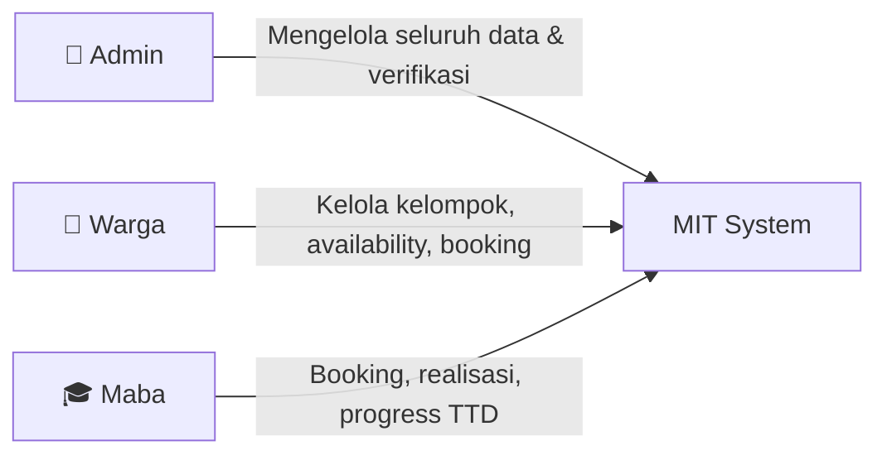
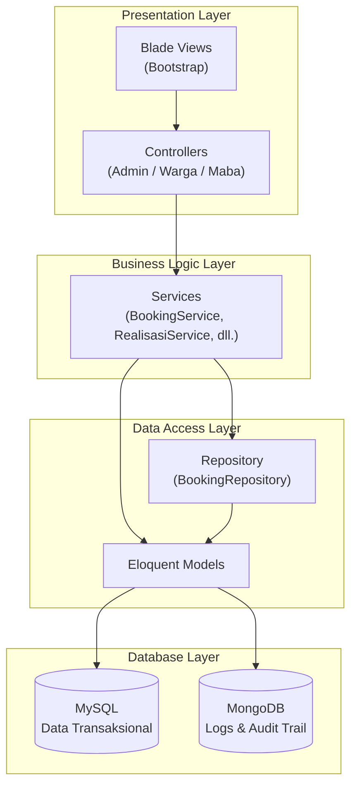
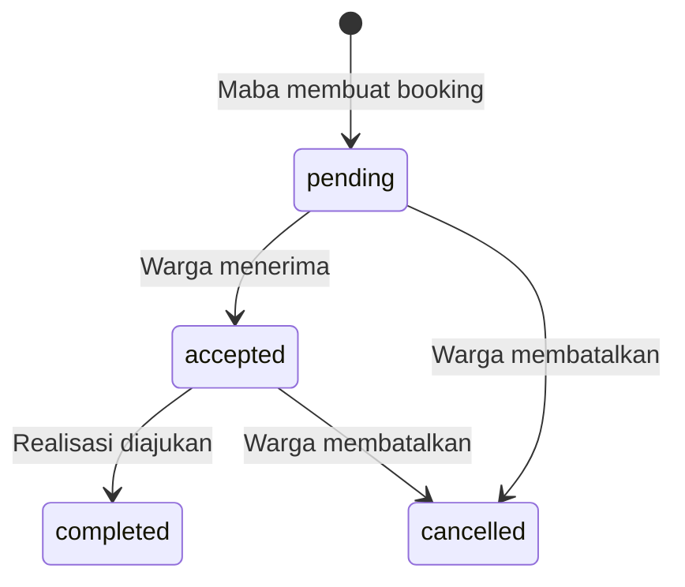
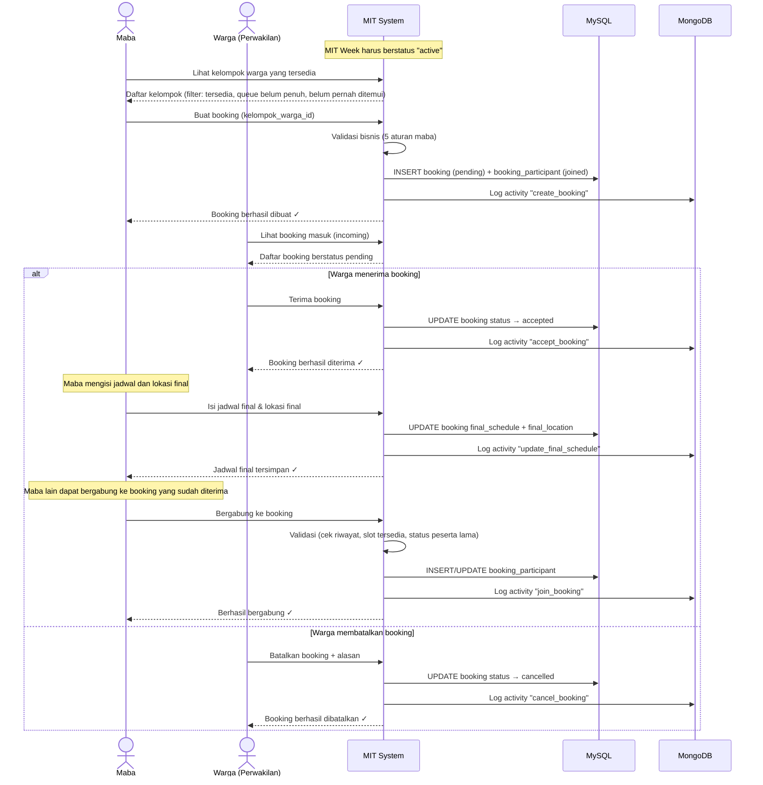
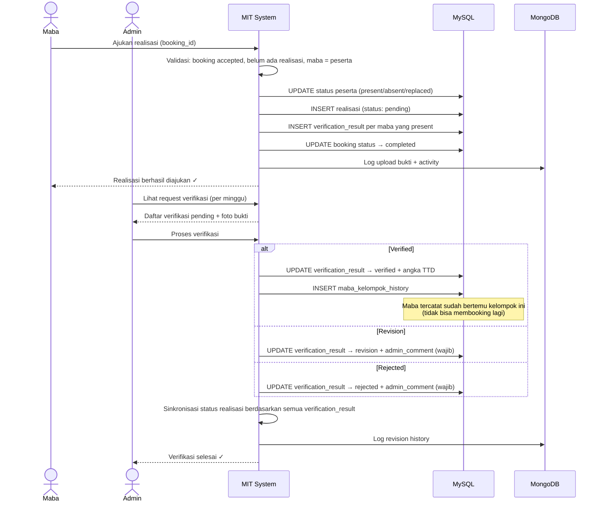

# Laporan Dokumentasi Teknis — Sistem Manajemen dan Koordinasi MIT

## Anggota Kelompok

| No | Nama | NRP |
|---:|---|:---:|
| 1 | Jonathan Steven Tjahyaputra | 5027251036 |
| 2 | Dewa Ngakan Gede Wira Adhimukti |5027251063 |
| 3 | I Made Gyanendra Anand Wisnawa | 5027251072 |
| 4 | Muhammad Rifki Pribadi | 5027251087 |

---

## Daftar Isi

1. [Identitas Proyek](#1-gambaran-umum-project)
2. [Arsitektur Teknis](#2-arsitektur-teknis)
3. [Desain Database](#3-desain-database)
4. [Arsitektur Aplikasi & Struktur Folder](#4-arsitektur-aplikasi--struktur-folder)
5. [Aturan Bisnis Utama](#5-aturan-utama-dalam-sistem)
6. [Alur Bisnis (Flow Diagrams)](#6-flow-diagrams)
7. [Routing & Endpoint](#7-routing--endpoint)
8. [Mekanisme Keamanan](#8-mekanisme-keamanan)
9. [Frontend & UI](#9-frontend--ui)
10. [Konfigurasi & Deployment](#10-konfigurasi--deployment)
11. [Ringkasan Statistik Proyek](#11-ringkasan-statistik-proyek)

---

## 1. Gambaran Umum Project

### 1.1 Deskripsi Sistem dan Permasalahan

Meet Information Technology atau MIT merupakan kegiatan pertemuan rutin antara mahasiswa baru Departemen Teknologi Informasi ITS dengan kakak tingkat atau warga untuk mengenal lingkungan departemen, membangun relasi, serta memahami budaya dan aturan yang berlaku. 

Kelompok warga terdiri dari warga yang berasal dari beberapa angkatan, terutama angkatan 2022, 2023, dan 2024 (ada yang satu angkatan ada yang campur). Setelah pertemuan selesai, maba mendapatkan tanda tangan dari warga yang hadir sebagai bukti bahwa pertemuan telah dilakukan.

Dalam kegiatan ini, setiap maba perlu mengumpulkan minimal 100 tanda tangan warga dengan ketentuan wajib setidaknya 4 dari angktan 2022, 24 dari angkatan 2023, dan 72 dari angkatan 2024.

Sistem Manajemen dan Koordinasi MIT adalah sistem manajemen pertemuan antara maba dan warga dalam lingkungan Departemen Teknologi Informasi ITS. Sistem ini mengelola siklus lengkap mulai dari pembentukan kelompok warga, penjadwalan booking pertemuan, pencatatan realisasi kehadiran, hingga verifikasi tanda tangan (TTD) oleh admin.

### 1.2 Tujuan Aplikasi

| No | Tujuan |
|----|--------|
| 1 | Mengelola data maba |
| 2 | Mengelola data warga |
| 3 | Membentuk kelompok warga |
| 4 | Mengatur minggu MIT aktif |
| 5 | Mengatur availability kelompok warga per minggu |
| 6 | Mengatur booking pertemuan maba dan warga |
| 7 | Mengatur realisasi pertemuan |
| 8 | Mengatur verifikasi tanda tangan |
| 9 | Menghitung progress tanda tangan maba |
| 10 | Memberikan rekomendasi kelompok warga |
| 11 | Menyimpan log aktivitas dan riwayat ke MongoDB |

### 1.3 Peran Pengguna (User Roles)

Sistem memiliki **3 role utama:**



#### Admin

> Admin **tidak disimpan sebagai tabel database**. Admin login menggunakan konfigurasi dari `.env` atau config Laravel (`config/mit.php`).

| Kemampuan Admin |
|-----------------|
| Mengelola data maba (CRUD) |
| Mengelola data warga (CRUD) |
| Mengelola kelompok warga (CRUD + anggota + perwakilan + finalisasi) |
| Mengelola minggu MIT (buat, aktifkan, tutup, toggle availability) |
| Memantau booking |
| Memantau queue aktif |
| Memantau realisasi |
| Memverifikasi tanda tangan |
| Melihat activity log (MongoDB) |
| Melihat recommendation log (MongoDB) |
| Melihat revision history (MongoDB) |

#### Warga

> Warga adalah **kakak tingkat** yang berasal dari angkatan 2022, 2023, dan 2024.

| Kemampuan Warga |
|-----------------|
| Melihat dashboard warga |
| Melihat kelompok sendiri |
| Mengisi availability mingguan (jika menjadi perwakilan kelompok) |
| Melihat booking masuk (incoming) |
| Accept booking (hanya perwakilan) |
| Cancel booking (hanya perwakilan) |
| Melihat booking accepted |
| Melihat riwayat booking |

#### Maba

> Maba adalah **mahasiswa baru** angkatan 2025 yang perlu mengumpulkan tanda tangan dari warga.

| Kemampuan Maba |
|----------------|
| Melihat dashboard maba |
| Melihat kelompok warga yang tersedia |
| Membuat request booking |
| Join booking accepted |
| Leave booking |
| Mengisi jadwal dan lokasi final pertemuan |
| Mengajukan realisasi |
| Melihat status verifikasi |
| Melihat progress tanda tangan |
| Melihat riwayat kelompok yang sudah ditemui |
| Meminta rekomendasi kelompok warga |

---

## 2. Arsitektur Teknis

### 2.1 Technology Stack

| Komponen | Teknologi | Keterangan |
|----------|-----------|------------|
| **Backend Framework** | Laravel ^13.8 | Framework utama |
| **Bahasa Backend** | PHP ^8.3 | Dengan ext-mongodb |
| **Template Engine** | Blade | Bawaan Laravel |
| **Styling** | Bootstrap | Sederhana, tanpa framework CSS lain |
| **Custom CSS** | `public/css/mit-custom.css` | Penyesuaian tampilan tambahan |
| **Database Relasional** | MySQL 8 | Data transaksional utama |
| **Database NoSQL** | MongoDB 5 | Log dan audit trail |
| **MongoDB Driver** | mongodb/laravel-mongodb ^5.7 | Integrasi MongoDB untuk Laravel |
| **Local Environment** | Laragon | Windows |

> [!IMPORTANT]
> Seluruh tampilan pada sistem  dibangun menggunakan **Blade + Bootstrap + custom CSS** agar tetap sederhana.

### 2.2 Pola Arsitektur: Service-Repository Pattern

Sistem menggunakan pemisahan layer sebagai berikut:



Berikut adalah ilustrasi lain dari pemisahan layer yang dilakukan sistem:

```
┌─────────────────────────────────────────────────────┐
│                   HTTP REQUEST                       │
└──────────────────────┬──────────────────────────────┘
                       ▼
┌─────────────────────────────────────────────────────┐
│              LAYER 1: CONTROLLER (23 files)          │
│                                                     │
│  • Menerima request, validasi input form             │
│  • Memanggil service untuk business logic            │
│  • Boleh query READ ringan untuk view                │
│  • Return Blade view + data                          │
│                                                     │
│  Admin/ (10)  │  Maba/ (7)  │  Warga/ (5)  │ Auth (1) │
└──────────────────────┬──────────────────────────────┘
                       ▼
┌─────────────────────────────────────────────────────┐
│              LAYER 2: SERVICE (14 files)              │
│                                                     │
│  • Business logic utama                              │
│  • Validasi aturan bisnis                            │
│  • DB::transaction() untuk atomicity                 │
│  • lockForUpdate() untuk concurrency                 │
│  • Semua operasi WRITE (create/update/delete)        │
│                                                     │
│  BookingService  │  RealisasiService  │  dll.        │
└──────────────────────┬──────────────────────────────┘
                       ▼
┌─────────────────────────────────────────────────────┐
│           LAYER 3: REPOSITORY (1 file)               │
│                                                     │
│  • Query kecil yang reusable                         │
│  • Dipanggil oleh banyak service                     │
│  • BookingRepository: 4 method                       │
└──────────────────────┬──────────────────────────────┘
                       ▼
┌─────────────────────────────────────────────────────┐
│         LAYER 4: MODEL + DATABASE (15 models)        │
│                                                     │
│  • Eloquent ORM → MySQL (11 model)                   │
│  • MongoDB\Eloquent → MongoDB (4 model)              │
│  • Relationship definitions (hasMany, belongsTo)     │
│  • Casts (boolean, date)                             │
│                                                     │
│  ┌──────────┐    ┌──────────┐                        │
│  │ MySQL 8  │    │ MongoDB 5│                        │
│  │ 11 tabel │    │ 4 koleksi│                        │
│  └──────────┘    └──────────┘                        │
└─────────────────────────────────────────────────────┘
```

### 2.3 Polyglot Persistence (Dual Database)

Sistem menggunakan dua jenis database, yakni:

| Database | Kegunaan | Alasan |
|----------|----------|--------|
| **MySQL** | Data transaksional utama (maba, warga, booking, realisasi, verifikasi, dsb.) | Integritas referensial, ACID transactions, foreign key constraints, relasi antar tabel |
| **MongoDB** | Activity logs, recommendation logs, revision history, upload bukti | Skema fleksibel, cocok untuk data log yang sering bertambah dan bersifat semi-terstruktur |

---

## 3. Desain Database

### 3.1 Entity Relationship Diagram (ERD)


### 3.2 Daftar Tabel MySQL (11 Tabel)

Seluruh tabel didefinisikan dalam satu file migration: `2026_06_09_021422_create_mit_tables.php`.

---

#### 3.2.1 Tabel `maba`

Menyimpan data mahasiswa baru.

| Kolom | Tipe Data | Constraint | Deskripsi |
|-------|-----------|------------|-----------|
| `maba_id` | BIGINT | PK, AUTO_INCREMENT | ID unik maba |
| `nama` | VARCHAR | NOT NULL | Nama lengkap maba |
| `nrp` | VARCHAR | UNIQUE, NOT NULL | Nomor Registrasi Pokok |
| `password` | VARCHAR | NOT NULL | Password (di-hash menggunakan `Hash::make()`) |
| `status` | ENUM('active','inactive') | DEFAULT 'active' | Status aktif maba |
| `created_at` | TIMESTAMP | — | Waktu pembuatan |
| `updated_at` | TIMESTAMP | — | Waktu pembaruan terakhir |

---

#### 3.2.2 Tabel `warga`

Menyimpan data warga (mahasiswa senior).

| Kolom | Tipe Data | Constraint | Deskripsi |
|-------|-----------|------------|-----------|
| `warga_id` | BIGINT | PK, AUTO_INCREMENT | ID unik warga |
| `nama` | VARCHAR | NOT NULL | Nama lengkap warga |
| `nrp` | VARCHAR | UNIQUE, NOT NULL | NRP warga |
| `angkatan` | YEAR | NOT NULL | Tahun angkatan (2022, 2023, 2024) |
| `password` | VARCHAR | NOT NULL | Password (di-hash) |
| `status` | ENUM('active','inactive') | DEFAULT 'active' | Status aktif |
| `created_at` | TIMESTAMP | — | Waktu pembuatan |
| `updated_at` | TIMESTAMP | — | Waktu pembaruan terakhir |

---

#### 3.2.3 Tabel `mit_week`

Menyimpan data minggu MIT yang menentukan periode aktif sistem.

| Kolom | Tipe Data | Constraint | Deskripsi |
|-------|-----------|------------|-----------|
| `week_id` | BIGINT | PK, AUTO_INCREMENT | ID minggu |
| `week_number` | INT UNSIGNED | UNIQUE | Nomor urut minggu (1, 2, 3, ...) |
| `start_date` | DATE | NOT NULL | Tanggal mulai minggu |
| `end_date` | DATE | NOT NULL | Tanggal selesai minggu |
| `status` | ENUM('upcoming','active','completed') | DEFAULT 'upcoming' | Status siklus hidup minggu |
| `availability_input_status` | ENUM('open','closed') | DEFAULT 'closed' | Apakah input availability dibuka |
| `created_at` | TIMESTAMP | — | Waktu pembuatan |
| `updated_at` | TIMESTAMP | — | Waktu pembaruan terakhir |

> [!NOTE]
> **Hanya boleh ada satu minggu dengan status `active` pada satu waktu.** Availability dan booking hanya berlaku pada minggu aktif.

---

#### 3.2.4 Tabel `kelompok_warga`

Menyimpan data kelompok warga secara umum.

| Kolom | Tipe Data | Constraint | Deskripsi |
|-------|-----------|------------|-----------|
| `kelompok_warga_id` | BIGINT | PK, AUTO_INCREMENT | ID kelompok |
| `kode_kelompok` | INT UNSIGNED | UNIQUE | Kode kelompok unik |
| `rules` | TEXT | NULLABLE | Aturan/keterangan kelompok |
| `status` | ENUM('draft','final') | DEFAULT 'draft' | Status finalisasi kelompok |
| `created_at` | TIMESTAMP | — | Waktu pembuatan |
| `updated_at` | TIMESTAMP | — | Waktu pembaruan terakhir |

> [!NOTE]
> Tabel `kelompok_warga` tidak menyimpan kolom perwakilan. Perwakilan ditentukan dari tabel `kelompok_warga_member` berdasarkan kolom `is_perwakilan = true`.

---

#### 3.2.5 Tabel `kelompok_warga_member`

Menghubungkan warga ke kelompoknya. Setiap warga hanya boleh berada di **satu kelompok**.

| Kolom | Tipe Data | Constraint | Deskripsi |
|-------|-----------|------------|-----------|
| `member_id` | BIGINT | PK, AUTO_INCREMENT | ID anggota |
| `kelompok_warga_id` | BIGINT | FK → kelompok_warga, CASCADE DELETE | Kelompok yang diikuti |
| `warga_id` | BIGINT | FK → warga, CASCADE DELETE, **UNIQUE** | Warga (1 warga = 1 kelompok) |
| `is_perwakilan` | BOOLEAN | DEFAULT false | Apakah menjadi perwakilan kelompok |
| `nomor_wa` | VARCHAR | NULLABLE | Nomor WhatsApp (wajib jika perwakilan) |
| `created_at` | TIMESTAMP | — | Waktu pembuatan |
| `updated_at` | TIMESTAMP | — | Waktu pembaruan terakhir |

**Constraint & Index:**
- `UNIQUE(kelompok_warga_id, warga_id)` — satu warga hanya satu kali di satu kelompok
- `UNIQUE(warga_id)` — satu warga hanya boleh di satu kelompok secara global
- `INDEX(kelompok_warga_id, is_perwakilan)` — optimasi query perwakilan

**Aturan Kelompok Warga:**

| No | Aturan |
|----|--------|
| 1 | Satu kelompok berisi **2 sampai 4 warga** |
| 2 | Setiap warga hanya boleh berada di **satu kelompok** |
| 3 | Setiap kelompok berstatus `final` harus memiliki **tepat satu perwakilan** |
| 4 | Perwakilan harus merupakan anggota kelompok tersebut |
| 5 | Nomor WA **wajib diisi** untuk perwakilan |
| 6 | Kelompok yang sudah `final` digunakan untuk proses MIT |


---

#### 3.2.6 Tabel `weekly_availability`

Menyimpan ketersediaan kelompok warga per minggu.

| Kolom | Tipe Data | Constraint | Deskripsi |
|-------|-----------|------------|-----------|
| `availability_id` | BIGINT | PK, AUTO_INCREMENT | ID availability |
| `week_id` | BIGINT | FK → mit_week, CASCADE DELETE | Minggu MIT |
| `kelompok_warga_id` | BIGINT | FK → kelompok_warga, CASCADE DELETE | Kelompok warga |
| `is_available` | BOOLEAN | DEFAULT true | Apakah tersedia minggu ini |
| `session_mode` | TINYINT UNSIGNED | DEFAULT 4 | Kapasitas maba per sesi (**hanya 4 atau 6**) |
| `session_count` | TINYINT UNSIGNED | DEFAULT 3 | Jumlah sesi/queue maksimum |
| `notes` | TEXT | NULLABLE | Catatan tambahan |
| `created_at` | TIMESTAMP | — | Waktu pembuatan |
| `updated_at` | TIMESTAMP | — | Waktu pembaruan terakhir |

**Constraint:** `UNIQUE(week_id, kelompok_warga_id)`

**Aturan Availability:**

| Aturan | Detail |
|--------|--------|
| `session_mode` hanya boleh **4** atau **6** | Menentukan kapasitas maba per sesi |
| Jika `session_mode = 4` | `session_count` maksimal **3** |
| Jika `session_mode = 6` | `session_count` maksimal **2** |
| Total kapasitas mingguan | Maksimal **12 maba per kelompok** (`session_mode × session_count ≤ 12`) |
| Queue aktif | Dihitung dari booking berstatus `pending` + `accepted` |
| Batas queue aktif | Mengikuti `session_count`, **bukan konstanta global** |

---

#### 3.2.7 Tabel `booking`

Tabel utama pencatatan booking pertemuan.

| Kolom | Tipe Data | Constraint | Deskripsi |
|-------|-----------|------------|-----------|
| `booking_id` | BIGINT | PK, AUTO_INCREMENT | ID booking |
| `week_id` | BIGINT | FK → mit_week, CASCADE DELETE | Minggu MIT |
| `kelompok_warga_id` | BIGINT | FK → kelompok_warga, CASCADE DELETE | Kelompok target |
| `created_by_maba_id` | BIGINT | FK → maba, CASCADE DELETE | Maba pembuat booking |
| `status` | ENUM('pending','accepted','cancelled','completed') | DEFAULT 'pending' | Status booking |
| `final_schedule` | DATETIME | NULLABLE | Jadwal final pertemuan (diisi maba setelah accepted) |
| `final_location` | VARCHAR | NULLABLE | Lokasi final pertemuan (diisi maba setelah accepted) |
| `cancelled_reason` | TEXT | NULLABLE | Alasan pembatalan |
| `warga_notes` | TEXT | NULLABLE | Catatan dari warga |
| `decided_by_warga_id` | BIGINT | FK → warga, NULLABLE, SET NULL ON DELETE | Warga yang memutuskan |
| `decided_at` | TIMESTAMP | NULLABLE | Waktu keputusan |
| `created_at` | TIMESTAMP | — | Waktu pembuatan |
| `updated_at` | TIMESTAMP | — | Waktu pembaruan terakhir |

**Index:** `INDEX(week_id, kelompok_warga_id, status)`

---

#### 3.2.8 Tabel `booking_participant`

Menyimpan peserta dari setiap booking.

| Kolom | Tipe Data | Constraint | Deskripsi |
|-------|-----------|------------|-----------|
| `booking_participant_id` | BIGINT | PK, AUTO_INCREMENT | ID peserta |
| `booking_id` | BIGINT | FK → booking, CASCADE DELETE | Booking yang diikuti |
| `maba_id` | BIGINT | FK → maba, CASCADE DELETE | Maba peserta |
| `status` | ENUM('joined','left','present','absent','replaced') | DEFAULT 'joined' | Status keikutsertaan |
| `replaced_by_maba_id` | BIGINT | FK → maba, NULLABLE, SET NULL ON DELETE | Maba pengganti |
| `joined_at` | TIMESTAMP | NULLABLE | Waktu bergabung |
| `left_at` | TIMESTAMP | NULLABLE | Waktu keluar |
| `created_at` | TIMESTAMP | — | Waktu pembuatan |
| `updated_at` | TIMESTAMP | — | Waktu pembaruan terakhir |

**Constraint:** `UNIQUE(booking_id, maba_id)` — Satu maba tidak boleh memiliki dua baris pada booking yang sama.

> [!NOTE]
> **Aturan penting peserta booking:**
> - Jika maba keluar dari booking → status diubah ke `left`, **data tidak  dihapus**
> - Jika maba bergabung ulang ke booking yang sama → **update baris lama** dari `left` ke `joined`, **bukan insert baris baru**
> - Halaman "Booking Saya" **hanya menampilkan** peserta berstatus `joined` dan `present`
> - Peserta berstatus `left`, `absent`, `replaced` **tidak ditampilkan** di "Booking Saya"

---

#### 3.2.9 Tabel `realisasi`

Menyimpan laporan realisasi pertemuan. Satu booking hanya memiliki satu realisasi (relasi 1:1).

| Kolom | Tipe Data | Constraint | Deskripsi |
|-------|-----------|------------|-----------|
| `realisasi_id` | BIGINT | PK, AUTO_INCREMENT | ID realisasi |
| `booking_id` | BIGINT | FK → booking, **UNIQUE**, CASCADE DELETE | Booking terkait (1:1) |
| `week_id` | BIGINT | FK → mit_week, CASCADE DELETE | Minggu MIT |
| `submitted_by_maba_id` | BIGINT | FK → maba, CASCADE DELETE | Maba pengaju |
| `realisasi_is_meeting_held` | BOOLEAN | DEFAULT true | Apakah pertemuan terlaksana |
| `is_warga_as_planned` | BOOLEAN | DEFAULT true | Apakah warga sesuai rencana |
| `absent_warga_notes` | TEXT | NULLABLE | Catatan warga yang absen |
| `additional_warga_notes` | TEXT | NULLABLE | Catatan warga tambahan |
| `general_notes` | TEXT | NULLABLE | Catatan umum |
| `status` | ENUM('pending','verified','revision','rejected') | DEFAULT 'pending' | Status verifikasi |
| `submitted_at` | TIMESTAMP | NULLABLE | Waktu pengajuan |
| `verified_at` | TIMESTAMP | NULLABLE | Waktu verifikasi selesai |
| `verified_by_admin_identifier` | VARCHAR | NULLABLE | Identitas admin verifikator |
| `created_at` | TIMESTAMP | — | Waktu pembuatan |
| `updated_at` | TIMESTAMP | — | Waktu pembaruan terakhir |

---

#### 3.2.10 Tabel `verification_result`

Menyimpan hasil verifikasi TTD (tanda tangan) per maba per realisasi.

| Kolom | Tipe Data | Constraint | Deskripsi |
|-------|-----------|------------|-----------|
| `verification_id` | BIGINT | PK, AUTO_INCREMENT | ID verifikasi |
| `realisasi_id` | BIGINT | FK → realisasi, CASCADE DELETE | Realisasi terkait |
| `maba_id` | BIGINT | FK → maba, CASCADE DELETE | Maba yang diverifikasi |
| `week_id` | BIGINT | FK → mit_week, CASCADE DELETE | Minggu MIT |
| `claimed_ttd_2022` | INT UNSIGNED | DEFAULT 0 | Klaim TTD angkatan 2022 |
| `claimed_ttd_2023` | INT UNSIGNED | DEFAULT 0 | Klaim TTD angkatan 2023 |
| `claimed_ttd_2024` | INT UNSIGNED | DEFAULT 0 | Klaim TTD angkatan 2024 |
| `verified_ttd_2022` | INT UNSIGNED | DEFAULT 0 | TTD terverifikasi 2022 |
| `verified_ttd_2023` | INT UNSIGNED | DEFAULT 0 | TTD terverifikasi 2023 |
| `verified_ttd_2024` | INT UNSIGNED | DEFAULT 0 | TTD terverifikasi 2024 |
| `status` | ENUM('pending','verified','revision','rejected') | DEFAULT 'pending' | Status verifikasi |
| `admin_comment` | TEXT | NULLABLE | Komentar admin |
| `verified_by_admin_identifier` | VARCHAR | NULLABLE | Identitas admin verifikator |
| `verified_at` | TIMESTAMP | NULLABLE | Waktu verifikasi |
| `created_at` | TIMESTAMP | — | Waktu pembuatan |
| `updated_at` | TIMESTAMP | — | Waktu pembaruan terakhir |

**Constraint:** `UNIQUE(realisasi_id, maba_id)`

**Target Tanda Tangan:**

| Angkatan | Target TTD |
|----------|------------|
| 2022 | 4 |
| 2023 | 24 |
| 2024 | 72 |
| **Total** | **100** |
| Minimum per minggu | 8 |

---

#### 3.2.11 Tabel `maba_kelompok_history`

Menyimpan riwayat maba yang sudah pernah bertemu kelompok warga tertentu. **Digunakan untuk mencegah maba bertemu kelompok yang sama dua kali.**

| Kolom | Tipe Data | Constraint | Deskripsi |
|-------|-----------|------------|-----------|
| `history_id` | BIGINT | PK, AUTO_INCREMENT | ID history |
| `maba_id` | BIGINT | FK → maba, CASCADE DELETE | Maba |
| `kelompok_warga_id` | BIGINT | FK → kelompok_warga, CASCADE DELETE | Kelompok yang sudah ditemui |
| `week_id` | BIGINT | FK → mit_week, CASCADE DELETE | Minggu pertemuan |
| `booking_id` | BIGINT | FK → booking, CASCADE DELETE | Booking terkait |
| `created_at` | TIMESTAMP | NULLABLE | Waktu pencatatan |

**Constraint:** `UNIQUE(maba_id, kelompok_warga_id)` — Maba hanya boleh bertemu satu kelompok warga **satu kali**.

> Riwayat dibuat **setelah realisasi diverifikasi** oleh admin (status `verified`).

---

### 3.3 Perancangan Data Non-Relational MongoDB

Pada MIT System, MongoDB digunakan sebagai database non-relational untuk menyimpan data log dan audit trail. Data utama seperti maba, warga, kelompok warga, booking, realisasi, dan verification result tetap disimpan di MySQL karena membutuhkan relasi, foreign key, dan transaksi yang kuat.

MongoDB digunakan untuk data yang bersifat:

1. Bertambah terus-menerus.
2. Tidak membutuhkan relasi kompleks.
3. Fleksibel secara struktur.
4. Cocok untuk kebutuhan audit trail.
5. Lebih sering dibaca sebagai riwayat daripada diubah.

Dengan demikian, MongoDB melengkapi MySQL untuk kebutuhan pencatatan aktivitas dan riwayat sistem.

---

#### 3.3.1 Jumlah Collection

MIT System menggunakan **4 collection MongoDB**, yaitu:

| No | Collection            | Fungsi                                                            |
| -- | --------------------- | ----------------------------------------------------------------- |
| 1  | `activity_logs`       | Menyimpan log aktivitas pengguna, khususnya maba dan warga        |
| 2  | `recommendation_logs` | Menyimpan riwayat permintaan dan hasil rekomendasi kelompok warga |
| 3  | `revision_histories`  | Menyimpan riwayat perubahan status verifikasi                     |
| 4  | `upload_bukti_logs`   | Menyimpan log upload bukti foto realisasi                         |

Jumlah collection dibuat terbatas agar struktur MongoDB tetap sederhana dan mudah dipahami. Setiap collection memiliki tujuan yang spesifik sehingga data log tidak bercampur dalam satu collection besar.

---

### 3.3.2 Struktur Collection `activity_logs`

Collection `activity_logs` digunakan untuk mencatat aktivitas penting yang dilakukan oleh pengguna, terutama maba dan warga.

Contoh aktivitas maba:

* Login.
* Logout.
* Membuat booking.
* Bergabung ke booking.
* Keluar dari booking.
* Mengisi jadwal final.
* Mengajukan realisasi.
* Meminta rekomendasi kelompok warga.

Contoh aktivitas warga:

* Login.
* Logout.
* Mengisi availability.
* Menerima booking.
* Membatalkan booking.

#### Struktur Dokumen

```json
{
  "_id": "ObjectId",
  "user_id": 1,
  "role": "maba",
  "action": "create_booking",
  "description": "Maba membuat request booking.",
  "metadata": {
    "booking_id": 5,
    "kelompok_warga_id": 3
  },
  "ip_address": "127.0.0.1",
  "user_agent": "Mozilla/5.0 ...",
  "created_at": "2026-06-17T10:30:00Z"
}
```

#### Penjelasan Field

| Field         | Tipe           | Deskripsi                                                                                |
| ------------- | -------------- | ---------------------------------------------------------------------------------------- |
| `_id`         | ObjectId       | ID unik dokumen MongoDB                                                                  |
| `user_id`     | Integer / Null | ID user dari MySQL. Untuk maba mengarah ke `maba_id`, untuk warga mengarah ke `warga_id` |
| `role`        | String         | Role pengguna, misalnya `maba`, `warga`, atau `admin` jika diperlukan                    |
| `action`      | String         | Nama aksi yang dilakukan                                                                 |
| `description` | String         | Deskripsi singkat aktivitas                                                              |
| `metadata`    | Object         | Data tambahan yang fleksibel sesuai aktivitas                                            |
| `ip_address`  | String         | IP address pengguna                                                                      |
| `user_agent`  | String         | Informasi browser/perangkat pengguna                                                     |
| `created_at`  | DateTime       | Waktu aktivitas dicatat                                                                  |

#### Embedding atau Referencing

Collection ini menggunakan kombinasi **referencing** dan **embedding**.

| Jenis       | Penerapan                                    | Alasan                                                        |
| ----------- | -------------------------------------------- | ------------------------------------------------------------- |
| Referencing | `user_id`, `booking_id`, `kelompok_warga_id` | ID tersebut mengarah ke data utama di MySQL                   |
| Embedding   | `metadata`                                   | Struktur metadata berbeda-beda tergantung aksi yang dilakukan |

Contoh referencing:

```json
{
  "user_id": 1,
  "metadata": {
    "booking_id": 5,
    "kelompok_warga_id": 3
  }
}
```

Contoh embedding pada metadata:

```json
{
  "metadata": {
    "final_schedule": "2026-06-20 09:00:00",
    "final_location": "Departemen Teknologi Informasi ITS"
  }
}
```

Data seperti `booking_id` dan `kelompok_warga_id` tidak disalin seluruh detailnya dari MySQL. MongoDB hanya menyimpan ID referensi dan informasi pendukung yang dibutuhkan untuk audit trail.

---

### 3.3.3 Struktur Collection `recommendation_logs`

Collection `recommendation_logs` digunakan untuk menyimpan riwayat permintaan rekomendasi kelompok warga oleh maba.

Collection ini penting karena sistem rekomendasi menghasilkan data yang fleksibel, seperti daftar input NRP, daftar kelompok yang direkomendasikan, skor, alasan rekomendasi, dan detail perhitungan.

#### Struktur Dokumen

```json
{
  "_id": "ObjectId",
  "requested_by_maba_id": 1,
  "input_nrp_list": [
    "5025261001",
    "5025261002"
  ],
  "recommended_groups": [
    {
      "kelompok_warga_id": 3,
      "kode_kelompok": 2,
      "score": 90,
      "sisa_queue": 2,
      "perwakilan": "Nama Warga",
      "nomor_wa": "081234567890"
    }
  ],
  "scoring_detail": [
    {
      "kelompok_warga_id": 3,
      "base_score": 40,
      "history_score": 30,
      "queue_score": 20,
      "rarely_chosen_score": 10,
      "final_score": 100,
      "notes": [
        "Kelompok tersedia",
        "Belum pernah ditemui",
        "Queue masih tersedia"
      ]
    }
  ],
  "created_at": "2026-06-17T11:00:00Z"
}
```

#### Penjelasan Field

| Field                  | Tipe            | Deskripsi                                                 |
| ---------------------- | --------------- | --------------------------------------------------------- |
| `_id`                  | ObjectId        | ID unik dokumen MongoDB                                   |
| `requested_by_maba_id` | Integer         | ID maba yang meminta rekomendasi                          |
| `input_nrp_list`       | Array           | Daftar NRP maba yang dimasukkan sebagai input rekomendasi |
| `recommended_groups`   | Array of Object | Snapshot hasil rekomendasi kelompok warga                 |
| `scoring_detail`       | Array of Object | Detail perhitungan skor rekomendasi                       |
| `created_at`           | DateTime        | Waktu rekomendasi dibuat                                  |

#### Embedding atau Referencing

Collection ini lebih banyak menggunakan **embedding** karena hasil rekomendasi bersifat snapshot.

| Jenis       | Penerapan                                                | Alasan                                                                         |
| ----------- | -------------------------------------------------------- | ------------------------------------------------------------------------------ |
| Referencing | `requested_by_maba_id`, `kelompok_warga_id`              | Tetap menyimpan ID untuk menghubungkan ke data MySQL jika diperlukan           |
| Embedding   | `input_nrp_list`, `recommended_groups`, `scoring_detail` | Hasil rekomendasi harus tersimpan sebagai riwayat pada saat rekomendasi dibuat |

Alasan menggunakan embedding pada `recommended_groups` dan `scoring_detail` adalah karena hasil rekomendasi perlu disimpan sebagai jejak historis. Jika data kelompok warga berubah di MySQL, log rekomendasi lama tetap merepresentasikan hasil rekomendasi pada waktu itu.

Contoh:

```json
{
  "recommended_groups": [
    {
      "kelompok_warga_id": 3,
      "kode_kelompok": 2,
      "score": 90,
      "sisa_queue": 2
    }
  ]
}
```

Data tersebut disimpan sebagai embedded document agar admin dapat melihat kembali alasan sistem memberikan rekomendasi pada saat tertentu.

---

### 3.3.4 Struktur Collection `revision_histories`

Collection `revision_histories` digunakan untuk menyimpan riwayat perubahan status pada proses verifikasi.

Collection ini berfungsi sebagai audit trail agar admin dapat melihat perubahan status dari suatu verification result, misalnya dari `pending` menjadi `verified`, atau dari `pending` menjadi `revision`.

#### Struktur Dokumen

```json
{
  "_id": "ObjectId",
  "verification_id": 10,
  "realisasi_id": 4,
  "maba_id": 1,
  "admin_identifier": "admin-demo",
  "old_status": "pending",
  "new_status": "revision",
  "comment": "Jumlah TTD tidak sesuai dengan bukti foto.",
  "changed_fields": {
    "verified_ttd_2022": {
      "old": 0,
      "new": 2
    },
    "verified_ttd_2023": {
      "old": 0,
      "new": 5
    },
    "verified_ttd_2024": {
      "old": 0,
      "new": 10
    }
  },
  "created_at": "2026-06-17T12:00:00Z"
}
```

#### Penjelasan Field

| Field              | Tipe          | Deskripsi                                  |
| ------------------ | ------------- | ------------------------------------------ |
| `_id`              | ObjectId      | ID unik dokumen MongoDB                    |
| `verification_id`  | Integer       | ID verification result dari MySQL          |
| `realisasi_id`     | Integer       | ID realisasi dari MySQL                    |
| `maba_id`          | Integer       | ID maba yang diverifikasi                  |
| `admin_identifier` | String        | Identifier admin yang memproses verifikasi |
| `old_status`       | String        | Status sebelum perubahan                   |
| `new_status`       | String        | Status setelah perubahan                   |
| `comment`          | String / Null | Catatan admin                              |
| `changed_fields`   | Object        | Detail field yang berubah                  |
| `created_at`       | DateTime      | Waktu perubahan dicatat                    |

#### Embedding atau Referencing

Collection ini menggunakan kombinasi **referencing** dan **embedding**.

| Jenis       | Penerapan                                    | Alasan                                                                            |
| ----------- | -------------------------------------------- | --------------------------------------------------------------------------------- |
| Referencing | `verification_id`, `realisasi_id`, `maba_id` | Menghubungkan log ke data utama di MySQL                                          |
| Embedding   | `changed_fields`                             | Perubahan field bersifat fleksibel dan berbeda-beda pada setiap proses verifikasi |

`changed_fields` menggunakan embedding karena jumlah dan nama field yang berubah tidak selalu sama. Contohnya, terkadang hanya status yang berubah, tetapi pada kasus lain nilai TTD dan komentar admin juga ikut berubah.

---

### 3.3.5 Struktur Collection `upload_bukti_logs`

Collection `upload_bukti_logs` digunakan untuk mencatat log upload bukti foto realisasi.

Data file fisik tetap disimpan pada storage Laravel, sedangkan MongoDB hanya menyimpan informasi log dan metadata upload.

#### Struktur Dokumen

```json
{
  "_id": "ObjectId",
  "realisasi_id": 4,
  "booking_id": 5,
  "submitted_by_maba_id": 1,
  "file_path": "realisasi/bukti/booking-5.jpg",
  "original_filename": "foto_buku_mit.jpg",
  "mime_type": "image/jpeg",
  "file_size": 245678,
  "created_at": "2026-06-17T12:30:00Z"
}
```

#### Penjelasan Field

| Field                  | Tipe     | Deskripsi                              |
| ---------------------- | -------- | -------------------------------------- |
| `_id`                  | ObjectId | ID unik dokumen MongoDB                |
| `realisasi_id`         | Integer  | ID realisasi dari MySQL                |
| `booking_id`           | Integer  | ID booking dari MySQL                  |
| `submitted_by_maba_id` | Integer  | ID maba yang mengunggah bukti          |
| `file_path`            | String   | Lokasi file bukti pada storage Laravel |
| `original_filename`    | String   | Nama asli file yang diunggah           |
| `mime_type`            | String   | Tipe file                              |
| `file_size`            | Integer  | Ukuran file dalam byte                 |
| `created_at`           | DateTime | Waktu upload dicatat                   |

#### Embedding atau Referencing

Collection ini lebih dominan menggunakan **referencing**.

| Jenis       | Penerapan                                                   | Alasan                                                             |
| ----------- | ----------------------------------------------------------- | ------------------------------------------------------------------ |
| Referencing | `realisasi_id`, `booking_id`, `submitted_by_maba_id`        | Data utama tetap berada di MySQL                                   |
| Embedding   | Metadata file seperti `file_path`, `mime_type`, `file_size` | Metadata file sederhana dan langsung melekat pada aktivitas upload |

File foto tidak disimpan langsung sebagai binary di MongoDB. Sistem hanya menyimpan metadata upload, sedangkan file sebenarnya disimpan di storage Laravel.

---

### 3.3.6 Ringkasan Kebutuhan Embedding dan Referencing

Secara umum, MIT System menggunakan pendekatan berikut:

| Data                                                                                                                 | Strategi                        | Alasan                                                     |
| -------------------------------------------------------------------------------------------------------------------- | ------------------------------- | ---------------------------------------------------------- |
| ID entitas utama seperti `maba_id`, `warga_id`, `booking_id`, `realisasi_id`, `verification_id`, `kelompok_warga_id` | Referencing                     | Data utama berada di MySQL dan perlu dijaga konsistensinya |
| Metadata aktivitas                                                                                                   | Embedding                       | Struktur metadata fleksibel tergantung jenis aktivitas     |
| Hasil rekomendasi                                                                                                    | Embedding                       | Perlu disimpan sebagai snapshot historis                   |
| Detail scoring rekomendasi                                                                                           | Embedding                       | Bentuk data kompleks dan tidak selalu sama                 |
| Perubahan field pada verifikasi                                                                                      | Embedding                       | Field yang berubah bisa berbeda-beda                       |
| Metadata file upload                                                                                                 | Embedding                       | Data melekat langsung pada aktivitas upload                |
| File bukti foto                                                                                                      | Referencing melalui `file_path` | File fisik disimpan di storage Laravel, bukan di MongoDB   |

---

### 3.3.7 Alasan Tidak Menggunakan Relasi Penuh di MongoDB

MongoDB tidak digunakan untuk menyimpan data utama seperti maba, warga, booking, realisasi, dan verification result karena data tersebut membutuhkan:

1. Foreign key.
2. Validasi relasional.
3. Transaksi yang kuat.
4. Konsistensi antar tabel.
5. Query terstruktur untuk proses bisnis.

Sebaliknya, MongoDB digunakan untuk data log karena data log:

1. Tidak membutuhkan foreign key.
2. Formatnya fleksibel.
3. Sering bertambah.
4. Jarang diubah.
5. Cocok disimpan sebagai dokumen.

Desain ini memungkinkan MySQL dan MongoDB memiliki tanggung jawab yang berbeda dan saling melengkapi.

### 3.4 Alasan Keputusan Desain Database

| Keputusan | Alasan |
|---|---|
| NRP tidak dijadikan primary key | NRP adalah identifier akademik dan dapat berubah/bermasalah secara administratif; sistem lebih aman memakai surrogate key seperti `maba_id` dan `warga_id`. |
| Admin tidak dibuat sebagai tabel | Admin hanya aktor sistem untuk demo dan konfigurasi, sehingga cukup disimpan di `.env`/`config/mit.php`. |
| Booking disimpan di MySQL | Booking membutuhkan relasi kuat dengan maba, kelompok warga, minggu MIT, dan participant. |
| Verification result disimpan di MySQL | Data ini menentukan progress TTD dan membutuhkan konsistensi relasional. |
| Target TTD tidak dibuat sebagai tabel | Target bersifat konfigurasi tetap, sehingga cukup disimpan di `config/mit.php`. |
| MongoDB hanya untuk log | Log bersifat fleksibel, bertambah terus, dan tidak membutuhkan foreign key. |
---


## 4. Arsitektur Aplikasi & Struktur Folder

### 4.1 Struktur Direktori Utama

```
mit-system/
├── app/
│   ├── Http/
│   │   ├── Controllers/
│   │   │   ├── Admin/              # Controllers admin (dashboard, CRUD, monitoring, verifikasi, logs)
│   │   │   ├── Auth/               # MitAuthController (login/logout)
│   │   │   ├── Maba/               # Controllers maba (dashboard, booking, realisasi, progress, rekomendasi)
│   │   │   └── Warga/              # Controllers warga (dashboard, availability, booking, kelompok)
│   │   └── Middleware/
│   │       └── MitRoleMiddleware   # Pengecekan role berbasis session
│   ├── Models/
│   │   ├── *.php                   # 11 Eloquent models (MySQL)
│   │   └── Mongo/                  # 4 MongoDB models
│   ├── Providers/
│   │   └── AppServiceProvider
│   ├── Repositories/
│   │   └── BookingRepository      # Satu-satunya repository yang aktif
│   └── Services/
│       ├── Admin/                  # Service khusus admin
│       ├── Web/                    # Service khusus web
│       ├── BookingService          # Logika perubahan data booking
│       ├── BookingQueryService     # Pengambilan data booking (hanya query, tidak mengubah data)
│       ├── RealisasiService        # Pengajuan realisasi
│       ├── VerificationService     # Verifikasi TTD oleh admin
│       ├── RecommendationService   # Algoritma rekomendasi
│       ├── TtdService              # Perhitungan progress TTD
│       ├── MongoLogService         # Pencatatan log ke MongoDB
│       └── WebAuthService          # Autentikasi
├── config/
│   ├── database.php                # Koneksi MySQL + MongoDB
│   └── mit.php                     # Konfigurasi khusus MIT (admin, target TTD)
├── database/
│   └── migrations/
│       └── 2026_06_09_021422_create_mit_tables.php  # Seluruh 11 tabel
├── resources/views/
│   ├── admin/                      # Blade views admin
│   ├── auth/                       # Halaman login
│   ├── components/                 # Blade components yang dapat digunakan ulang
│   ├── layouts/                    # Layout utama + partials (sidebar, topbar, flash)
│   ├── maba/                       # Blade views maba
│   └── warga/                      # Blade views warga
├── routes/
│   └── web.php                     # Seluruh definisi route
└── public/css/
    └── mit-custom.css              # CSS tambahan
```

### 4.2 Daftar Model Eloquent

#### Model MySQL (11 Model)

| No | Model | Tabel | PK | Relasi Utama |
|----|-------|-------|----|-------------|
| 1 | `Maba` | maba | maba_id | hasMany: Booking, BookingParticipant, MabaKelompokHistory |
| 2 | `Warga` | warga | warga_id | hasOneThrough: KelompokWarga; hasOne: KelompokWargaMember |
| 3 | `MitWeek` | mit_week | week_id | — (cast: start_date, end_date → date) |
| 4 | `KelompokWarga` | kelompok_warga | kelompok_warga_id | hasMany: Members, Availabilities; hasOne: RepresentativeMember; hasOneThrough: Representative |
| 5 | `KelompokWargaMember` | kelompok_warga_member | member_id | belongsTo: KelompokWarga, Warga (cast: is_perwakilan → boolean) |
| 6 | `WeeklyAvailability` | weekly_availability | availability_id | belongsTo: KelompokWarga, MitWeek |
| 7 | `Booking` | booking | booking_id | belongsTo: KelompokWarga, Maba (creator), MitWeek; hasMany: Participants; hasOne: Realisasi |
| 8 | `BookingParticipant` | booking_participant | booking_participant_id | belongsTo: Booking, Maba |
| 9 | `Realisasi` | realisasi | realisasi_id | belongsTo: Booking, Maba (submitter), MitWeek; hasMany: VerificationResult |
| 10 | `VerificationResult` | verification_result | verification_id | belongsTo: Maba, Realisasi, MitWeek |
| 11 | `MabaKelompokHistory` | maba_kelompok_history | history_id | belongsTo: Maba, KelompokWarga, MitWeek, Booking |

#### Model MongoDB (4 Model)

| No | Model | Koleksi | Connection |
|----|-------|---------|------------|
| 1 | `ActivityLog` | activity_logs | mongodb |
| 2 | `RecommendationLog` | recommendation_logs | mongodb |
| 3 | `RevisionHistory` | revision_histories | mongodb |
| 4 | `UploadBuktiLog` | upload_bukti_logs | mongodb |

### 4.3 Daftar Service Classes

| No | Service | Fungsi Utama |
|----|---------|-------------|
| 1 | `BookingService` | Mengubah data booking: create, accept, cancel, join, leave, update final schedule |
| 2 | `BookingQueryService` | Query-only: available groups, joinable bookings |
| 3 | `RealisasiService` | Submit realisasi, update status peserta (present/absent/replaced) |
| 4 | `VerificationService` | Verifikasi TTD per maba oleh admin, sync status realisasi |
| 5 | `RecommendationService` | Algoritma scoring rekomendasi kelompok warga |
| 6 | `TtdService` | Menghitung progress TTD maba per angkatan (2022/2023/2024) |
| 7 | `MongoLogService` | Write log ke MongoDB: activity, recommendation, revision, upload |
| 8 | `WebAuthService` | Login admin (env-based), warga (NRP + hash), maba (NRP + hash) |

### 4.4 Repository

Repository yang digunakan secara aktif hanya satu, yaitu `BookingRepository`:

| No | Method | Deskripsi |
|----|--------|-----------|
| 1 | `activeWeek()` | Mengambil minggu MIT yang berstatus `active` |
| 2 | `activeQueueCount(weekId, kelompokId)` | Menghitung booking berstatus `pending` + `accepted` pada kelompok tertentu |
| 3 | `activeParticipantCount(bookingId)` | Menghitung peserta berstatus `joined` + `present` pada booking tertentu |
| 4 | `mabaHasActiveBookingSameGroup(mabaId, kelompokId)` | Mengecek apakah maba memiliki booking aktif pada kelompok yang sama |

> [!NOTE]
> Peserta berstatus `left`, `absent`, dan `replaced` **tidak dianggap aktif** oleh repository ini.

---

## 5. Aturan Utama dalam Sistem

### 5.1 Aturan Booking

#### Validasi untuk Maba

| No | Aturan | Pengecekan |
|----|--------|------------|
| 1 | Tidak boleh membooking kelompok yang **sudah pernah ditemui** | Cek tabel `maba_kelompok_history` |
| 2 | Tidak boleh memiliki **booking aktif pada kelompok yang sama** | Cek booking berstatus `pending`/`accepted` dengan peserta `joined`/`present` |
| 3 | Tidak boleh **bergabung ke booking yang sudah penuh** | Cek `activeParticipantCount >= session_mode` |
| 4 | Hanya boleh bergabung ke booking berstatus **`accepted`** | Cek `booking.status === 'accepted'` |
| 5 | Maba harus berstatus **`active`** | Cek `maba.status === 'active'` |

#### Validasi untuk Warga

| No | Aturan | Pengecekan |
|----|--------|------------|
| 1 | Menerima booking → hanya **perwakilan kelompok** | Cek `kelompok_warga_member.is_perwakilan = true` |
| 2 | Membatalkan booking → hanya **perwakilan kelompok** | Sama seperti di atas |
| 3 | Menerima hanya booking berstatus **`pending`** | Cek `booking.status === 'pending'` |
| 4 | Membatalkan hanya booking berstatus **`pending`** atau **`accepted`** | Cek status booking |

#### Diagram Status Booking



### 5.2 Aturan Realisasi

Saat realisasi diajukan oleh maba:

| No | Aksi |
|----|------|
| 1 | Booking berubah menjadi `completed` |
| 2 | Status peserta diperbarui menjadi `present`/`absent`/`replaced` sesuai input |
| 3 | `VerificationResult` dibuat untuk setiap maba yang `present` |
| 4 | Upload bukti foto dicatat ke MongoDB (`upload_bukti_logs`) |
| 5 | Activity log dicatat ke MongoDB (`activity_logs`) |

### 5.3 Aturan Verifikasi

| Status | Deskripsi | Aksi Lanjutan |
|--------|-----------|---------------|
| `verified` | TTD valid | Membuat record di `maba_kelompok_history` (maba tercatat sudah bertemu kelompok) |
| `revision` | Perlu perbaikan | `admin_comment` **wajib diisi** |
| `rejected` | Ditolak | `admin_comment` **wajib diisi** |

**Sinkronisasi status realisasi** berdasarkan seluruh `VerificationResult` yang terkait:
- Jika ada yang berstatus `pending` → realisasi `pending`
- Jika ada yang berstatus `revision` → realisasi `revision`
- Jika semua berstatus `verified` → realisasi `verified`
- Jika semua berstatus `rejected` → realisasi `rejected`
- Selain itu → realisasi `revision`

### 5.4 Algoritma Rekomendasi

Sistem menggunakan **algoritma scoring** untuk merekomendasikan 5 kelompok warga terbaik:

| Kriteria | Skor | Kondisi |
|----------|------|---------|
| Kelompok tersedia pada minggu aktif | **+40** | Skor dasar (baseline) |
| Semua maba belum pernah bertemu kelompok | **+30** | Tidak ada riwayat di `maba_kelompok_history` |
| Ada maba yang sudah pernah bertemu kelompok | **-100** | Riwayat ditemukan → didiskualifikasi |
| Ada maba dengan booking aktif ke kelompok | **-100** | Booking `pending`/`accepted` sudah ada |
| Queue masih tersedia | **+20** | `queue_count < max_queue` |
| Queue penuh | **-100** | `queue_count >= max_queue` → didiskualifikasi |
| Kelompok jarang dipilih | **+10** | Jumlah booking `completed` ≤ 1 |

**Input:** 1 sampai 4 NRP maba aktif.  
**Output:** 5 kelompok teratas beserta skor, sisa queue, dan kontak perwakilan.

---

## 6. Flow Diagrams

### 6.1 Alur Booking Pertemuan



### 6.2 Alur Realisasi & Verifikasi TTD



---

## 7. Routing & Endpoint

### 7.1 Autentikasi (`/mit/*`)

| Method | URI | Route Name | Controller | Fungsi |
|--------|-----|------------|------------|--------|
| GET | `/mit/login` | `mit.login` | `MitAuthController@showLogin` | Halaman login |
| POST | `/mit/login` | `mit.login.post` | `MitAuthController@login` | Proses login |
| POST | `/mit/logout` | `mit.logout` | `MitAuthController@logout` | Logout |

### 7.2 Admin Routes (`/admin/*`) — Middleware: `mit.role:admin`

| Method | URI | Route Name | Fungsi |
|--------|-----|------------|--------|
| GET | `/admin/dashboard` | `admin.dashboard` | Dashboard admin |
| **Monitoring Booking** |
| GET | `/admin/booking` | `admin.booking.index` | Monitoring booking |
| GET | `/admin/booking/{id}` | `admin.booking.show` | Detail booking |
| **Pengelolaan Maba** |
| GET/POST | `/admin/maba` | `admin.maba.*` | CRUD maba (index, create, store, edit, update, destroy) |
| **Pengelolaan Warga** |
| GET/POST | `/admin/warga` | `admin.warga.*` | CRUD warga (index, create, store, edit, update, destroy) |
| **Pengelolaan Kelompok Warga** |
| GET/POST | `/admin/kelompok-warga` | `admin.kelompok-warga.*` | CRUD kelompok |
| POST | `/admin/kelompok-warga/{id}/members` | `admin.kelompok-warga.members.store` | Tambah anggota |
| DELETE | `/admin/kelompok-warga/members/{id}` | `admin.kelompok-warga.members.destroy` | Hapus anggota |
| POST | `/admin/kelompok-warga/members/{id}/representative` | `admin.kelompok-warga.members.representative` | Tetapkan perwakilan |
| POST | `/admin/kelompok-warga/{id}/finalize` | `admin.kelompok-warga.finalize` | Finalisasi kelompok |
| **Pengelolaan MIT Week** |
| GET/POST | `/admin/mit-week` | `admin.mit-week.*` | Index, create, store |
| POST | `/admin/mit-week/{id}/activate` | `admin.mit-week.activate` | Aktifkan minggu |
| POST | `/admin/mit-week/{id}/close` | `admin.mit-week.close` | Tutup minggu |
| POST | `/admin/mit-week/{id}/toggle-availability` | `admin.mit-week.toggle-availability` | Buka/tutup input availability |
| **Monitoring Realisasi** |
| GET | `/admin/realisasi` | `admin.realisasi.index` | Monitoring realisasi |
| GET | `/admin/realisasi/{id}` | `admin.realisasi.show` | Detail realisasi |
| **Verifikasi TTD** |
| GET | `/admin/verification` | `admin.verification.index` | Halaman verifikasi |
| GET | `/admin/verification/requests` | `admin.verification.requests` | Daftar request verifikasi |
| GET | `/admin/verification/{id}` | `admin.verification.show` | Detail verifikasi |
| POST | `/admin/verification/{id}/process` | `admin.verification.process` | Proses verifikasi |
| **Queue & Log** |
| GET | `/admin/queue` | `admin.queue.index` | Monitoring queue |
| GET | `/admin/logs` | `admin.logs.index` | Halaman utama log MongoDB |
| GET | `/admin/logs/activity` | `admin.logs.activity` | Log aktivitas |
| GET | `/admin/logs/recommendation` | `admin.logs.recommendation` | Log rekomendasi |
| GET | `/admin/logs/revision` | `admin.logs.revision` | Log revisi |

### 7.3 Warga Routes (`/warga/*`) — Middleware: `mit.role:warga`

| Method | URI | Route Name | Fungsi |
|--------|-----|------------|--------|
| GET | `/warga/dashboard` | `warga.dashboard` | Dashboard warga |
| GET | `/warga/availability/edit` | `warga.availability.edit` | Form edit availability |
| POST | `/warga/availability` | `warga.availability.update` | Simpan availability |
| GET | `/warga/kelompok-saya` | `warga.kelompok.show` | Lihat kelompok sendiri |
| GET | `/warga/booking/incoming` | `warga.booking.incoming` | Booking masuk (pending) |
| GET | `/warga/booking/accepted` | `warga.booking.accepted` | Booking yang sudah diterima |
| GET | `/warga/booking/history` | `warga.booking.history` | Riwayat booking |
| GET | `/warga/booking/{id}` | `warga.booking.show` | Detail booking |
| POST | `/warga/booking/{id}/accept` | `warga.booking.accept` | Menerima booking |
| POST | `/warga/booking/{id}/cancel` | `warga.booking.cancel` | Membatalkan booking |

### 7.4 Maba Routes (`/maba/*`) — Middleware: `mit.role:maba`

| Method | URI | Route Name | Fungsi |
|--------|-----|------------|--------|
| GET | `/maba/dashboard` | `maba.dashboard` | Dashboard maba |
| GET | `/maba/booking/available-groups` | `maba.booking.available-groups` | Kelompok warga yang tersedia |
| POST | `/maba/booking` | `maba.booking.store` | Membuat booking baru |
| GET | `/maba/booking/joinable` | `maba.booking.joinable` | Booking yang bisa diikuti |
| POST | `/maba/booking/join` | `maba.booking.join` | Bergabung ke booking |
| GET | `/maba/booking/mine` | `maba.booking.mine` | Booking saya |
| GET | `/maba/booking/{id}` | `maba.booking.show` | Detail booking |
| POST | `/maba/booking/{id}/leave` | `maba.booking.leave` | Keluar dari booking |
| GET | `/maba/booking/{id}/final-schedule` | `maba.booking.final-schedule.edit` | Form jadwal & lokasi final |
| PUT | `/maba/booking/{id}/final-schedule` | `maba.booking.final-schedule.update` | Simpan jadwal & lokasi final |
| GET | `/maba/realisasi/create` | `maba.realisasi.create` | Form realisasi |
| POST | `/maba/realisasi` | `maba.realisasi.store` | Mengajukan realisasi |
| GET | `/maba/realisasi/{id}` | `maba.realisasi.show` | Detail realisasi |
| GET | `/maba/progress` | `maba.progress.index` | Progress TTD |
| GET | `/maba/verification-status` | `maba.verification.index` | Status verifikasi |
| GET | `/maba/recommendation` | `maba.recommendation.index` | Form rekomendasi |
| POST | `/maba/recommendation` | `maba.recommendation.generate` | Menghasilkan rekomendasi |
| GET | `/maba/history` | `maba.history.index` | Riwayat pertemuan |
| GET | `/maba/history/check` | `maba.history.check` | Mengecek riwayat |

---

## 8. Mekanisme Keamanan

### 8.1 Autentikasi (Berbasis Session)

Sistem menggunakan **session-based authentication** tanpa Laravel Auth guard bawaan.

| Session Key | Deskripsi |
|-------------|-----------|
| `mit_role` | Role pengguna: `admin`, `warga`, atau `maba` |
| `mit_user_id` | ID pengguna (boleh null untuk admin) |
| `mit_name` | Nama pengguna |
| `mit_identifier` | Identifier (digunakan untuk admin) |

Mekanisme login per role:

| Role | Metode Autentikasi |
|------|-------------------|
| Admin | Username & password dari `config/mit.php` (berbasis env), dibandingkan dengan `hash_equals()` |
| Warga | NRP + password dari tabel `warga`, dibandingkan dengan `Hash::check()` |
| Maba | NRP + password dari tabel `maba`, dibandingkan dengan `Hash::check()` |

### 8.2 Otorisasi (Middleware)

```php
class MitRoleMiddleware
{
    public function handle(Request $request, Closure $next, string ...$roles): Response
    {
        $currentRole = session('mit_role');
        if (!$currentRole || !in_array($currentRole, $roles, true)) {
            return redirect()->route('mit.login')
                ->with('error', 'Silakan login / tidak memiliki akses.');
        }
        return $next($request);
    }
}
```

| Middleware | Akses |
|-----------|-------|
| `mit.role:admin` | Hanya admin |
| `mit.role:warga` | Hanya warga |
| `mit.role:maba` | Hanya maba |

### 8.3 Keamanan Transaksi Database

Seluruh operasi bisnis kritis menggunakan:
- `DB::transaction()` — menjamin atomicity (semua berhasil atau tidak sama sekali)
- `lockForUpdate()` — mencegah race condition pada operasi bersamaan

Operasi yang dilindungi: membuat booking, menerima booking, membatalkan booking, bergabung ke booking, keluar dari booking, mengajukan realisasi, verifikasi TTD.

---

## 9. Frontend & UI

### 9.1 Layout & Partials

| File | Fungsi |
|------|--------|
| `layouts/app.blade.php` | Layout utama dengan sidebar + topbar |
| `layouts/partials/sidebar.blade.php` | Sidebar navigasi (dinamis sesuai role) |
| `layouts/partials/topbar.blade.php` | Bilah atas (nama user, tombol logout) |
| `layouts/partials/flash.blade.php` | Pesan kilat (success/error) |

### 9.2 Blade Components

| Komponen | Fungsi |
|----------|--------|
| `booking-status` | Badge status booking (pending/accepted/cancelled/completed) |
| `empty-state` | Tampilan ketika tidak ada data |
| `page-header` | Header halaman dengan judul |
| `realisasi-status` | Badge status realisasi (pending/verified/revision/rejected) |
| `stat-card` | Kartu statistik pada dashboard |
| `verification-status` | Badge status verifikasi |

### 9.3 Ringkasan Halaman

| Role | Jumlah View | Area |
|------|-------------|------|
| Auth | 1 | Login |
| Admin | Beberapa | Dashboard, Booking, Kelompok Warga, Logs, Maba, MIT Week, Queue, Realisasi, Verifikasi, Warga |
| Maba | Beberapa | Dashboard, Booking, History, Progress, Realisasi, Rekomendasi, Verifikasi |
| Warga | Beberapa | Dashboard, Availability, Booking, Kelompok |
| Components | 6 | Blade components yang dapat digunakan ulang |

> Jumlah file view dapat berubah mengikuti revisi implementasi. Struktur utama terdiri dari Controller, Service, Repository, Model, dan Blade View.

---

## 10. Konfigurasi & Deployment

### 10.1 Environment Variables

```env
APP_NAME="MIT System"
APP_ENV=local
APP_URL=http://127.0.0.1:8000

# MySQL
DB_CONNECTION=mysql
DB_HOST=127.0.0.1
DB_PORT=3306
DB_DATABASE=mit_system
DB_USERNAME=root
DB_PASSWORD=

# MongoDB
MONGODB_URI=mongodb://127.0.0.1:27017
MONGODB_DATABASE=mit_logs

# Session & Cache
CACHE_STORE=file
SESSION_DRIVER=file
QUEUE_CONNECTION=sync

# Kredensial Admin
MIT_ADMIN_USERNAME=admin
MIT_ADMIN_PASSWORD=your_admin_password
```

> [!WARNING]
> Pada implementasi nyata, nilai password admin **tidak boleh dipublikasikan** dan harus disimpan di file `.env` lokal yang tidak masuk ke version control.

### 10.2 Konfigurasi MIT (`config/mit.php`)

```php
return [
    'admin' => [
        'username'   => env('MIT_ADMIN_USERNAME', 'admin'),
        'password'   => env('MIT_ADMIN_PASSWORD'),
        'identifier' => env('MIT_ADMIN_IDENTIFIER', 'admin-demo'),
    ],
    'target_ttd' => [
        '2022'           => 4,
        '2023'           => 24,
        '2024'           => 72,
        'total'          => 100,
        'minimum_weekly' => 8,
    ],
];
```

### 10.3 Menjalankan Aplikasi

Aplikasi dijalankan menggunakan **Laragon** pada lingkungan Windows.

```bash
# 1. Install dependensi PHP
composer install

# 2. Salin file konfigurasi environment
cp .env.example .env

# 3. Generate application key
php artisan key:generate

# 4. Jalankan migrasi database MySQL
php artisan migrate

# 5. Jalankan seeder (jika tersedia)
php artisan db:seed

# 6. Buat symbolic link untuk storage
php artisan storage:link

# 7. Bersihkan semua cache
php artisan optimize:clear

# 8. Jalankan server
php artisan serve
```

> Aplikasi dapat diakses di `http://127.0.0.1:8000`

**Opsional** — Jika menggunakan asset Vite untuk pengembangan:
```bash
npm install
npm run dev
```

### 10.4 Prasyarat Sistem

| Komponen | Versi Minimum | Keterangan |
|----------|--------------|------------|
| PHP | 8.3 | Dengan ekstensi ext-mongodb |
| MySQL | 8.0 | Database utama |
| MongoDB | 5.0 | Database log |
| Composer | 2.x | Package manager PHP |
| Laragon | Terbaru | Lingkungan pengembangan lokal (Windows) |

---

## 11. Ringkasan Statistik Proyek

| Metrik | Jumlah | Keterangan |
|--------|--------|------------|
| Tabel MySQL | 11 | Terverifikasi dari migration |
| Koleksi MongoDB | 4 | Terverifikasi dari model Mongo |
| Model Eloquent (MySQL) | 11 | Terverifikasi dari `app/Models/` |
| Model Eloquent (MongoDB) | 4 | Terverifikasi dari `app/Models/Mongo/` |
| Controllers | 23 | Terverifikasi dari `app/Http/Controllers/` |
| Services | 14 | Terverifikasi dari `app/Services/` |
| Repository | 1 | Hanya `BookingRepository` yang aktif |
| Blade Views | 57 | Terverifikasi dari `resources/views/` |
| Blade Components | 6 | Terverifikasi dari `resources/views/components/` |
| Route Endpoints | ~50+ | Didefinisikan di `routes/web.php` |
| Migration Files | 1 | Satu file mencakup seluruh tabel |
| Middleware Kustom | 1 | `MitRoleMiddleware` |

---

